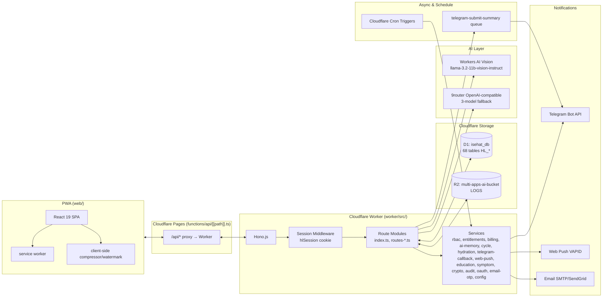
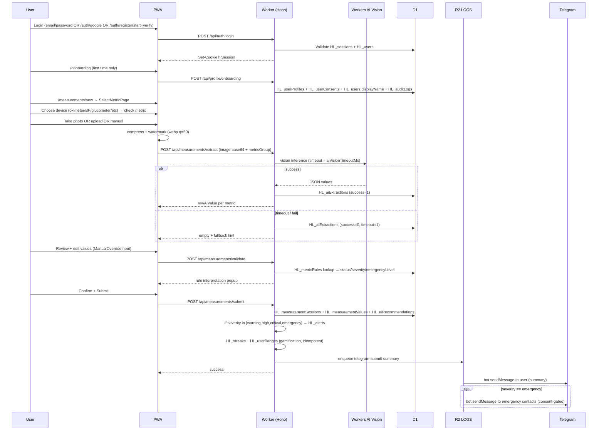
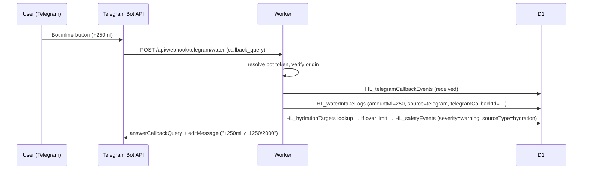
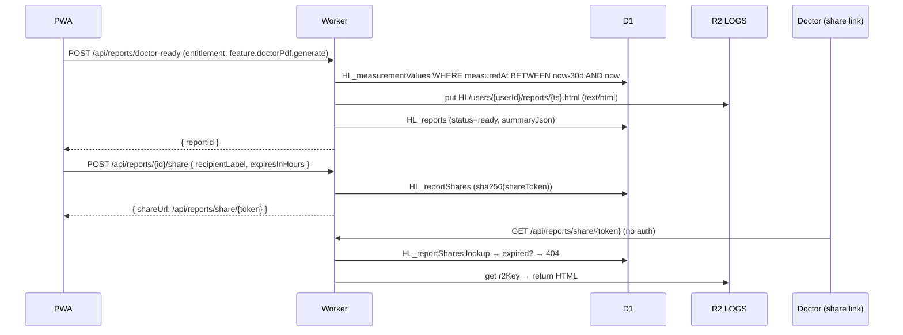

# ARCHITECTURE — iSehat

> **Dokumen ini dibuat berdasarkan audit langsung terhadap source code di repo (worker/, web/, docs/03.SQL_SCHEMA_*, docs_sprint5/04.SQL_SEED_*, worker/migrations/*).**
> Status: **Sprint 1–5 selesai, Sprint 5F (foundation hardening) & S5X (auth/billing/i18n) delivered, Sprint 6 AI Clinical Copilot di-defer.**
> Dokumen lama: lihat `archive/docs_legacy_2025_sprint1-5/04-ARCHITECTURE.md`.

---

## 1. Overview

iSehat adalah aplikasi kesehatan digital yang berjalan 100% di stack Cloudflare. Pengguna dapat:

1. Login (email/password lokal, OTP email, OAuth Google) lalu menyelesaikan onboarding profile.
2. Mengukur tanda vital (tekanan darah, glukosa, kolesterol, asam urat, SpO2, berat, dll) lewat foto, upload, atau input manual.
3. Mendapat ekstraksi nilai via **Workers AI Vision** (`@cf/meta/llama-3.2-11b-vision-instruct`), dengan **manual override** wajib.
4. Validasi nilai lewat **`HL_metricRules`** (rule-first, AI-assisted).
5. Submit pengukuran, simpan lampiran (compressed + watermarked webp) ke **R2**, dan broadcast via **Telegram** (submit summary & emergency alert).
6. Melihat dashboard (today / weekly / monthly / comparison / daily-health-hub) dan laporan (daily / weekly / monthly / doctor-ready 30 hari, share token).
7. Mengatur keluarga/caregiver (RBAC), kontak darurat (encrypted, dengan consent), pengingat minum obat, pattern detection (sleep↔BP, weight↔BP, medication).
8. Menggunakan fitur Sprint 5: Hydration tracker, Cycle tracking (dengan guardrail), AI Assistant (premium, dengan medical safety filter), Education cards, Symptom logging, Family-sensitive permissions, Xendit/Mock billing, AI Memory (Vectorize-ready infrastructure).

Prinsip desain:

```text
Rule-first, AI-assisted        — severity/emergency SELALU dari HL_metricRules.
Manual-verification-first      — setiap nilai AI wajib bisa di-override.
Cloudflare-native              — Workers + D1 + R2 + Queues + Cron + Workers AI + Vectorize-ready.
Free-tier-conscious            — kompres + watermark di client, no original image, OCR rate-limited.
Mobile-first, PWA-ready        — Service worker + manifest + bottom-nav + FAB.
Medical-safety                 — AI tidak boleh diagnose/prescribe/ubah dosis; semua red flag deterministic server-side.
Privacy-by-design              — sensitive field encrypted (AES-GCM `enc:v1:`); no plaintext secret di D1/log/bundle.
```

---

## 2. Stack & Bindings

### 2.1 Runtime

| Layer | Tech | Source |
|---|---|---|
| Frontend | React 19 + Vite + TypeScript | `web/` (npm workspaces) |
| PWA | `public/manifest.json` + `public/sw.js` + bottom-nav | `web/src/App.tsx`, `web/src/main.tsx` |
| API Gateway | Hono.js di Cloudflare Workers | `worker/src/index.ts` (6400 LOC) + `routes-*.ts` |
| Database | Cloudflare D1 → `DB` binding `isehat_db` | `worker/wrangler.toml` |
| Object storage | Cloudflare R2 → `LOGS` binding `multi-apps-ai-bucket` | `worker/wrangler.toml` |
| Queue producer/consumer | `TELEGRAM_QUEUE` → `telegram-submit-summary`; `AI_MEMORY_QUEUE` → `ai-memory-jobs` | `worker/wrangler.toml` |
| Scheduler | Cloudflare Cron Triggers (`scheduledHandler`) | `worker/src/routes-extra.ts` |
| AI Vision | `@cf/meta/llama-3.2-11b-vision-instruct` (Workers AI binding `AI`) | configurable via `HL_systemConfigs` |
| AI Text | 9router OpenAI-compatible, 3-model fallback | `HL_systemConfigs.aiTextEndpoint`, `aiTextModels`, `aiTextDefaultModel`, `aiTextApiKey` |
| Auth | HTTP-only cookie `hlSession` + `D1` `HL_sessions` | `routes-extra.ts::getCurrentSession` |
| OAuth | Google OAuth 2.0 (`/api/auth/google*`) | `routes-auth.ts` |
| Email | Email OTP via `email-otp.ts` + `email-sender.ts` | `routes-auth.ts` |

### 2.2 Bindings (no new DB / R2 bucket — reuse existing)

```toml
# worker/wrangler.toml
name = "hl-health-companion-api"
main = "src/index.ts"
compatibility_date = "2026-06-20"
workers_dev = true

[[d1_databases]]
binding = "DB"
database_name = "isehat_db"
database_id = "d777e991-ddc9-4072-8522-06cb08a6538c"

[[r2_buckets]]
binding = "LOGS"
bucket_name = "multi-apps-ai-bucket"

[[queues.producers]]
queue = "telegram-submit-summary"
binding = "TELEGRAM_QUEUE"

[[queues.producers]]
queue = "ai-memory-jobs"
binding = "AI_MEMORY_QUEUE"

[[queues.consumers]]
queue = "telegram-submit-summary"
max_batch_size = 10
max_batch_timeout = 5

[[queues.consumers]]
queue = "ai-memory-jobs"
max_batch_size = 5
max_batch_timeout = 10

[vars]
EMAIL_PROVIDER = "resend"
EMAIL_FROM = "iSehat <otp@mail.isehat.biz.id>"
EMAIL_OTP_TTL_SECONDS = "600"
EMAIL_OTP_MAX_ATTEMPTS = "5"
EMAIL_OTP_RESEND_COOLDOWN_SECONDS = "60"
EMAIL_OTP_MAX_RESENDS = "3"
EMAIL_OTP_TEST_MODE = "false"
AI_TEXT_API_BASE = "https://9router.krpmerch.biz.id/v1"
AI_TEXT_MODEL = "oc/deepseek-v4-flash-free"
BILLING_PROVIDER = "xendit_test"
XENDIT_MODE = "test"
XENDIT_BASE_URL = "https://api.xendit.co"
BILLING_CURRENCY = "IDR"
BILLING_SUCCESS_URL = "https://app.isehat.biz.id/billing/success"
BILLING_CANCEL_URL = "https://app.isehat.biz.id/billing/cancel"
VAPID_PUBLIC_KEY = "BJazmolj-Nf6eACLfCesD92Uobws77I6X0ADanxIEpc-BBcRATkbBBJwZWxj_A7IIkt042qYKdEkR3jP1myvcRA"
VAPID_SUBJECT = "mailto:admin@isehat.biz.id"
# VAPID_PRIVATE_KEY must be set via: wrangler secret put VAPID_PRIVATE_KEY
```

### 2.3 Secrets (Cloudflare env, NEVER di D1 / seed / log)

```text
ENCRYPTION_KEY              — AES-GCM key (≥16 char) untuk data sensitif.
CRON_SECRET                 — bearer token untuk /api/internal/cron/*.
TELEGRAM_BOT_TOKEN          — fallback kalau HL_systemConfigs.telegramBotToken kosong.
VAPID_PRIVATE_KEY           — Web Push (optional).
GOOGLE_OAUTH_CLIENT_ID      — Google OAuth (Spring 5A).
GOOGLE_OAUTH_CLIENT_SECRET  — Google OAuth.
OAUTH_REDIRECT_BASE_URL     — base URL callback.
XENDIT_SECRET_KEY           — billing (Spring 5F/X).
XENDIT_WEBHOOK_SECRET       — billing webhook verification.
EMAIL_SMTP_* / SENDGRID_*   — email OTP delivery (configurable).
```

D1 menyimpan HANYA **referensi/metadata** (`HL_configMetadata.storageMode ∈ {'d1','env','secret','reference'}`). Plaintext secret TIDAK boleh ada di `HL_systemConfigs`.

---

## 3. Naming Conventions

```text
Table prefix: HL_
No extra underscore after HL_
Field names: camelCase
Constraint ENUMs: lower camel or kebab-case as defined in CHECK
JSON columns: payloadJson / summaryJson / dataJson / metadataJson / configurationJson
```

Valid: `HL_users`, `HL_userProfiles`, `HL_measurementSessions`, `userId`, `createdAt`, `finalValue`, `manualOverride`.
Invalid: `users`, `HL_user_profiles`, `created_at`, `manual_override`, `HL_educationViews` (dilarang — lihat `HL_userEducationProgress`).

---

## 4. High-Level Architecture



---

## 5. Project Layout (Actual)

```text
health/
├── docs/                              # dokumen final (file ini)
│   ├── 04-ARCHITECTURE.md             # file ini
│   ├── 05-api-contract.md             # API contract
│   ├── 06-design-system.md            # design system
│   ├── 07-schema.sql                  # Sprint 1-4 baseline D1 schema
│   ├── 08-seed.sql                    # Sprint 1-4 baseline seed
│   ├── 03.SQL_SCHEMA_SPRINT5_FINAL_REVISED_AI_SPRINT6_READY.sql  # Sprint 5 additive schema
│   ├── 01.PRD_SPRINT5_…               # PRD Sprint 5 final revised
│   └── 02.PRD_USER_STORIES_…          # user stories Sprint 5
├── docs_sprint5/                      # working file Sprint 5 (planning/seed)
│   ├── 04.SQL_SEED_SPRINT5_FINAL_…    # Sprint 5 seed (roles, plans, features, configs)
│   ├── 08.TASK_PLAN_SPRINT5_…         # task plan + mockup
│   ├── 09–11                          # test, stress, TDD plan
│   ├── AUDIT_SPRINT5*.md              # audit reports per phase
│   └── Frontend/                      # mockup HTML (admin, premium, education, audit)
├── archive/
│   ├── docs_legacy_2025_sprint1-5/    # arsip dokumen lama yang sudah usang
│   ├── WORK_LOG_Sprint1-4.md          # log Sprint 1-4
│   └── Frontend-not-used/             # frontend lama yang sudah tidak dipakai
├── worker/                            # Cloudflare Worker (Hono)
│   ├── wrangler.toml                  # binding DB / LOGS / queue
│   ├── migrations/                    # additive D1 migrations
│   │   ├── 001_s5x_auth_email_otp.sql
│   │   └── 002_s5x_whatsapp_profile.sql
│   ├── scripts/                       # seed-metric-rules, e2e-uat
│   ├── src/
│   │   ├── index.ts                   # 6400 LOC — semua route Sprint 1-5 (auth, profile, measurements, dashboard, AI, reports, kb, alerts, notifications, reminders, family, emergency, medications, fasting, badges, streaks, patterns, settings, telegram, kb, dev)
│   │   ├── routes-admin.ts            # /api/admin/dashboard/summary, /api/plans, /api/me/subscribe (75 LOC)
│   │   ├── routes-ai.ts               # /api/ai/{context/query,context-package,memory/status,memory/rebuild,memory,disclaimer/enforce} + admin AI (142 LOC)
│   │   ├── routes-auth.ts             # /api/auth/{google,register/start|verify,login/start|verify,otp/resend,change-password} + /api/education/cards, /api/symptoms/*, /api/dashboard/daily-health (505 LOC)
│   │   ├── routes-cycle.ts            # /api/cycle/* + /api/family-links/:id/permissions/{cycle,sensitive-health} (180 LOC)
│   │   ├── routes-extra.ts            # /api/emergency/contacts/:id/consent, /api/family/access-check, /api/patterns/generate/*, /api/emergency/contacts/notify, /api/internal/cron/reminders, /api/medications/adherence, /api/reports/*, /api/fasting/*, /api/streaks, /api/badges, /api/measurements/drafts|/:id, /api/dashboard/comparison, /api/ai/recommendations, /api/kb/:slug, /api/settings/consent, /api/dev/seed-test-data, /api/patterns (1096 LOC) + scheduledHandler
│   │   ├── routes-hydration.ts        # /api/hydration/{settings,today,logs,history,logs/:logId} (134 LOC)
│   │   ├── routes-telegram.ts         # /api/webhook/telegram/water, /api/telegram/water-webhook, /api/internal/cron/hydration-reminders (212 LOC)
│   │   ├── services/                  # 22 service modules
│   │   │   ├── ai-memory.ts           # buildContextPackage, calculateDataSufficiency, enforceDisclaimer, logQuery, logRebuildJob
│   │   │   ├── audit.ts               # writeAudit
│   │   │   ├── billing/               # checkout-session, subscription-activation, config, provider (mock + xendit)
│   │   │   ├── config.ts              # getSystemConfig{Number,String,Boolean,JSON}, cache TTL 5 min
│   │   │   ├── crypto.ts              # AES-GCM encrypt/decrypt (enc:v1: prefix)
│   │   │   ├── cycle.ts               # cycle calendar computation, fertility window, guardrail
│   │   │   ├── education.ts           # getCards, acknowledgeCard
│   │   │   ├── email-otp.ts           # generate, hash (PBKDF2), verify, rate limit
│   │   │   ├── email-sender.ts        # SMTP / SendGrid adapter
│   │   │   ├── entitlements.ts        # requireEntitlement(plan feature)
│   │   │   ├── hydration.ts           # daily target calculation, overhydration check
│   │   │   ├── oauth.ts               # Google OAuth state, exchange, link
│   │   │   ├── rbac.ts                # requirePermission(userId, code)
│   │   │   ├── symptom.ts             # red flag detection
│   │   │   ├── telegram-callback.ts   # callback query parse, quick-add
│   │   │   ├── telegram-client.ts     # sendMessage helper
│   │   │   ├── telegram-config.ts     # resolve bot token from systemConfig
│   │   │   └── web-push.ts            # VAPID send to subscriptions
│   │   ├── i18n/                      # locale, error-codes, email-templates, disclaimer-templates
│   │   ├── shared-types/constants.ts  # enum constants (severities, statuses, alert types, role codes, etc)
│   │   └── types.ts                   # Env, Bindings, ApiError, ApiSuccess
│   └── test/                          # 22 test files (vitest-style .mjs)
│       ├── audit-service.test.mjs
│       ├── config-service.test.mjs
│       ├── email-otp.test.mjs
│       ├── entitlements-service.test.mjs
│       ├── rbac-service.test.mjs
│       ├── register.test.mjs
│       ├── sprint5-*.test.mjs         # 5A, 5B, 5C, 5D, 5E, 5F, 5X integration & unit
│       └── sprint5-types.test.mjs
├── web/                               # React 19 PWA
│   ├── index.html                     # SPA shell
│   ├── vite.config.ts                 # proxy /api → worker
│   ├── playwright.config.ts           # E2E
│   ├── functions/api/                 # Pages Functions (mirrors worker routes — production proxy)
│   ├── public/
│   │   ├── manifest.json              # PWA manifest
│   │   ├── sw.js                      # service worker
│   │   ├── icon-192.svg / icon-512.svg
│   │   └── favicon.svg
│   ├── frontend_stitch/               # legacy Stitch mockup HTML (referensi)
│   ├── e2e/smoke/                     # Playwright smoke (auth, admin, i18n, sprint5a-e, regression)
│   └── src/
│       ├── main.tsx                   # bootstrap + SW register + installPrompt capture
│       ├── App.tsx                    # 510 LOC — SPA shell: AuthProvider → I18nProvider → ToastProvider → AppRoutes
│       │                              # NAV_GROUPS (Dashboard, Measurements, Reports, Health Tracking, Lifestyle, AI, Family, Education, Settings, Admin), 47 routes
│       ├── pages/                     # 47 page files (auth, dashboard, measurement, reports, settings, etc)
│       ├── components/                # 22 components (auth/, dashboard/, measurement/, shared/, i18n/)
│       ├── context/                   # AuthContext + useAuth
│       ├── hooks/                     # useAiExtract, useEntitlements
│       ├── utils/                     # apiRetry, bmiCalculator, csv, dateFormat, imageCompressor, validation, watermark
│       ├── api/                       # translateError
│       ├── lib/api.ts                 # fetch wrapper
│       ├── i18n/                      # index.tsx + locales/{auth, ai, alerts, billing, caregiver, common, cycle, dashboard, doctor, emergency, errors, family, fasting, hydration, kb, medications, nav, onboarding, patterns, reminders, reports, settings, symptom}.ts
│       ├── types/constants.ts         # FE-side enums
│       └── styles/                    # senior-mode.css, high-contrast.css
├── functions/api/[[path]].ts          # Pages Function — proxies /api/* to Worker origin
├── site/                              # Astro public marketing site (blog, pricing, features)
├── stress/                            # k6-style stress scripts
└── package.json                       # monorepo workspaces (web, worker)
```

---

## 6. Core Principles

### 6.1 Rule First, AI Assisted

Severity/emergency SELALU dari `HL_metricRules` (lihat `worker/src/index.ts::measurements/submit`). AI text (9router) dipakai untuk **narrative, summary, comparison** saja; AI vision untuk ekstraksi nilai. Pipeline:

```text
finalValue
  → physical validation (HL_metricCatalog.physicalMin/Max)
  → HL_metricRules lookup by (metricCode, sex, ageMin/Max, minValue/maxValue, status)
  → status / severity / emergencyLevel
  → HL_alerts row (kalau severity ∈ {warning,high,critical,emergency})
  → HL_safetyEvents row (Sprint 5 non-metric guardrails — symptom red flag, overhydration, cycle irregularity)
  → in-app notification + Telegram + optional caregiver
```

AI Vision timeout: configurable di `HL_systemConfigs.aiVisionTimeoutMs` (default 5000). Timeout / parse-fail → fallback manual input; TIDAK memblokir submit. AI Text mengikuti model fallback order di `aiTextModels` (comma-separated atau JSON array). `FORBIDDEN_PHRASES` di `index.ts` (resep obat, dosis, dll) — kalau AI output mengandung kata terlarang → replaced dengan fallback safe + `safetyStatus='filtered'`.

### 6.2 Original Image Is Not Stored

Alur upload lampiran di `routes-extra.ts` + frontend `AttachmentUploader.tsx`:

```text
User takes photo
  → FE kompres (webp, quality 50) + watermark (timestamp + username)
  → POST /api/measurements/attachments/upload (multipart)
  → Worker maxUploadSizeBytes check (configurable)
  → R2 put HL/users/{userId}/measurements/{sessionId}/{metricCode}-{ts}.webp
  → HL_measurementAttachments row (watermarked=1, compressed=1, compressionQuality=50)
  → HL_measurementSessions.hasAttachment=1
```

Dilarang keras: simpan original ke R2, simpan base64 ke D1, simpan unwatermarked image.

### 6.3 Onboarding Profile Gate

User baru WAJIB `POST /api/profile/onboarding` sebelum akses dashboard (`App.tsx::AppRoutes`). Worker:

1. Validasi `hlSession` cookie.
2. Validasi fields (sex ∈ male/female/other, heightCm > 0, birthDate valid, timezone valid).
3. Upsert `HL_userProfiles`, `HL_userConsents` (aiConsent, dataShareConsent, emergencyConsent), `HL_users.displayName`.
4. Append `HL_auditLogs` action=`profileOnboardingComplete`.
5. FE panggil `GET /api/auth/me` lagi → `requiresOnboarding=false` → redirect ke `/dashboard`.

### 6.4 Free-Tier Efficiency

```text
Client-side image compression + watermark       (web/src/utils/imageCompressor, watermark)
Configurable AI Vision timeout                  (HL_systemConfigs.aiVisionTimeoutMs)
Configurable OCR rate limit                     (HL_systemConfigs.ocrRateLimitMax, ocrRateLimitWindowMin)
Dashboard uses 48h window + JS-side tz filter   (routes/index.ts::dashboard/today)
Configurable cron secret + cron batch           (routes-extra.ts::scheduledHandler)
Sensitive data encrypted at rest                (services/crypto.ts, ENCRYPTION_KEY)
Sprint 5 safety events use HL_safetyEvents      (bukan HL_alerts)
Sprint 5 AI context fields use HL_aiRecommendationContexts  (bukan ALTER HL_aiRecommendations)
```

### 6.5 Sensitive Data Encryption

`worker/src/services/crypto.ts` — AES-GCM via `ENCRYPTION_KEY` (SHA-256 derived key). Format ciphertext: `enc:v1:{base64url(iv)}:{base64url(cipher)}`. Legacy plaintext tetap readable sampai di-migrasi. Encrypted fields (saat ini):

```text
HL_telegramLinks.telegramChatId
HL_emergencyContacts.contactName, contactPhone, telegramChatId
HL_medicationLogs.note
HL_measurementSessions.notes (where applicable)
```

### 6.6 No Hardcoded Configurations

Semua angka yang bisa berubah baca dari `HL_systemConfigs` lewat `services/config.ts` (TTL 5 menit, in-memory `Map<DB, Map<key, {value, expiresAt}>>`):

```text
aiVisionTimeoutMs               — AI Vision timeout (default 5000)
aiTextEndpoint                  — base URL OpenAI-compatible
aiTextModels                    — JSON array atau comma-separated
aiTextDefaultModel              — default model name
aiTextApiKey                    — bearer token (D1 reference only; real secret di env)
maxUploadSizeBytes              — batas upload lampiran (default 2 MB)
ocrRateLimitMax                 — OCR per user per window
ocrRateLimitWindowMin           — window (menit)
telegramBotToken                — bot token (reference)
telegramBotActive               — '1'/'0' toggle
clinicalCopilotEnabled          — Sprint 5 SELALU false; Sprint 6 toggle
```

Cache invalidation: `invalidateSystemConfig(db)` dipanggil setelah admin update.

---

## 7. Main User Flows

### 7.1 Capture a Measurement



### 7.2 Hydration Quick-Add (Telegram)



### 7.3 Doctor-Ready PDF (HTML to R2)



---

## 8. RBAC, Plans, and Entitlements

```text
HL_users ──< HL_userRoles >── HL_roles
                          └──< HL_rolePermissions >── HL_permissions

HL_users ──< HL_subscriptions >── HL_plans
                          └──< HL_planFeatures >── (featureCode)

HL_usageCounters (userId, featureCode, usageWindow, usedCount, quotaLimitSnapshot, resetAt)

services/rbac.ts::requirePermission(userId, code)            → checks HL_userRoles + HL_rolePermissions
services/entitlements.ts::requireEntitlement(db, userId, featureCode)
                                                              → checks HL_subscriptions.status + HL_planFeatures + HL_usageCounters
```

Roles (seeded, systemRole=1):
`user`, `support`, `admin`, `superAdmin`, `billingAdmin`, `aiConfigAdmin`, `medicalReviewer`.

Plans (seeded): `free`, `premiumMonthly`, `premiumQuarterly`, `premiumYearly`, `familyPremium`.

Fitur yang di-gate per-plan (lihat `docs_sprint5/04.SQL_SEED_…`):

| Feature | free | premiumMonthly | familyPremium |
|---|---|---|---|
| `feature.symptomLog.use` | ✓ unlimited | ✓ | ✓ |
| `feature.hydration.use` | basic | advanced | advanced |
| `feature.aiAssistant.use` | 3 / month | 100 / month | 100 / month |
| `feature.aiReport.use` | ✗ | 30 / month | 30 / month |
| `feature.doctorPdf.generate` | ✗ | 10 / month | 10 / month |
| `feature.vectorMemory.use` | ✗ | ✓ (infra only, Sprint 6 ready) | ✓ |
| `feature.aiClinicalCopilot.use` | ✗ | ✗ (Sprint 6 placeholder) | ✗ |
| `feature.telegramReminder.use` | ✗ | ✓ | ✓ |
| `feature.familyDashboard.use` | ✗ | ✗ | ✓ |
| `feature.cycleTracking.use` | ✗ | ✓ | ✓ |
| `feature.advancedHistory.use` | 30 day retention | unlimited | unlimited |
| `feature.exportFull.use` | ✗ | ✓ | ✓ |
| `feature.medicationReminder.use` | 3 lifetime | unlimited | unlimited |
| `feature.fastingInsight.use` | ✗ | ✓ | ✓ |

API `ENTITLEMENT_REQUIRED` (403) ketika user Free akses fitur paid.

---

## 9. Medical & Privacy Safety (Sprint 5 Hard Boundaries)

```text
Sprint 5 non-metric safety events  → HL_safetyEvents  (BUKAN HL_alerts).
Sprint 5 AI context fields         → HL_aiRecommendationContexts (BUKAN ALTER HL_aiRecommendations).
Education progress                 → HL_userEducationProgress (BUKAN HL_educationViews).
No plaintext secret                → D1 / seed / frontend / API response / log / audit metadata.
Real secrets                       → Cloudflare Secrets / Env. D1 hanya configured/masked/envVarName/secretRef.
Admin mutations                    → HL_auditLogs(userId, action, entityType, entityId, metadataJson).
Auth, RBAC, entitlement, quota, family permission,
cycle eligibility, webhook, cron, red flag, disclaimer  → semua server-side.
Sprint 1-4 behavior                → tetap backward compatible.
```

Forbidden table names (unless explicitly in final docs):

```text
HL_educationViews
HL_userPreferences (untuk education progress)
actorId/targetType/targetId in HL_auditLogs
plaintext Google / OAuth / Telegram / AI / Billing / Internal secrets
```

AI medical behavior:

```text
AI TIDAK BOLEH: decide emergency, diagnose definitif, prescribe, change medication dosage,
                claim replace doctors, satu-satunya sumber medical severity/guardrail.

WAJIB deterministic:
  - Measurement status/severity  → dari HL_metricRules flow.
  - Symptom red flag             → deterministic server-side (services/symptom.ts).
  - Overhydration                → warning-only, BUKAN diagnosis.
  - Cycle contraception guardrail→ blocking UI (bukan toast-only).
  - AI medical output            → WAJIB server-side disclaimer (i18n/disclaimer-templates.ts).
```

Sensitive data (require owner OR explicit family permission OR restricted admin permission + audit):

```text
symptom detail, red flag detail, cycle, pregnancy, lactation, menopause,
AI memory, doctor report detail, caregiver access, support/admin sensitive access.
```

---

## 10. AI Infrastructure

```text
Workers AI Vision
  binding AI (default @cf/meta/llama-3.2-11b-vision-instruct)
  configurable via HL_systemConfigs.aiVisionModel
  timeout configurable via aiVisionTimeoutMs

9router Text AI (OpenAI-compatible)
  endpoint = HL_systemConfigs.aiTextEndpoint
  models   = HL_systemConfigs.aiTextModels (JSON array atau comma-separated)
  default  = HL_systemConfigs.aiTextDefaultModel
  apiKey   = HL_systemConfigs.aiTextApiKey (reference; real key di Cloudflare Secret)

Safety
  FORBIDDEN_PHRASES list (worker/src/index.ts) → replace dengan safe fallback
  enforceDisclaimer(service) → append server-side medical disclaimer (i18n)

Memory (Sprint 5C infrastructure, runtime deferred ke Sprint 6)
  HL_vectorDocuments   — vectorize-ready index (status pending/indexed/failed/deleted/skipped)
  HL_aiContextQueries  — log setiap query context
  HL_aiRecommendationContexts — 1:1 ke HL_aiRecommendations (patternScore 1-100, scoreReason, usedFallback, modelName, disclaimer)
  HL_aiMemoryJobs      — rebuild/delete/backfill/indexSource job queue
  services/ai-memory.ts::buildContextPackage / calculateDataSufficiency / logQuery / logRebuildJob
```

Sprint 5C **TIDAK** membangun AI Clinical Copilot runtime. Flag `clinicalCopilotEnabled` di config SELALU `false` di Sprint 5. Endpoint `/api/ai/assistant` dengan `clinicalCopilotMode: true` → respond `403 AI_CLINICAL_COPILOT_DEFERRED`.

---

## 11. Deployment

```text
1. cd worker
2. npx tsc -p tsconfig.json
3. npm test
4. wrangler d1 execute isehat_db --remote --file=../docs/07-schema.sql
5. wrangler d1 execute isehat_db --remote --file=../docs/08-seed.sql
6. wrangler d1 execute isehat_db --remote --file=../docs_sprint5/04.SQL_SEED_SPRINT5_FINAL_REVISED_AI_SPRINT6_READY.sql
7. wrangler d1 execute isehat_db --remote --command="PRAGMA foreign_key_check;"
8. wrangler deploy
9. cd ../web && npm run build && wrangler pages deploy dist
```

Deployed URLs:

| App | URL |
|---|---|
| Worker API | `https://hl-health-companion-api.indiehomesungairaya.workers.dev` |
| Pages Frontend | `https://app.isehat.biz.id` |

Pages proxy `/api/*` → Worker via `functions/api/[[path]].ts`. `worker/wrangler.toml` uses `app.isehat.biz.id` for billing success/cancel URLs and `mail.isehat.biz.id` for the Resend email sender domain.

---

## 12. Multi-Agent Operating Rules (tetap)

Lihat `AGENTS.md` (resume-safe, vibe-coding safe). Aturan penting untuk coding agent:

1. Baca `AGENTS.md` + `HANDOFF.md` + 3–5 entry terakhir `WORK_LOG.md` sebelum edit.
2. Source of truth order: SQL schema > seed > API contract > PRD > task plan.
3. TDD: RED → GREEN → REFACTOR → SECURITY → LOG → NEXT.
4. Update `WORK_LOG.md` + `HANDOFF.md` setiap task cycle.
5. Sprint order: Foundation → 5A → 5B → 5C → 5D → 5E → 5F → 5X → Cross-Phase Release Gate.
6. Sprint 6 deferred: AI Clinical Copilot runtime.
