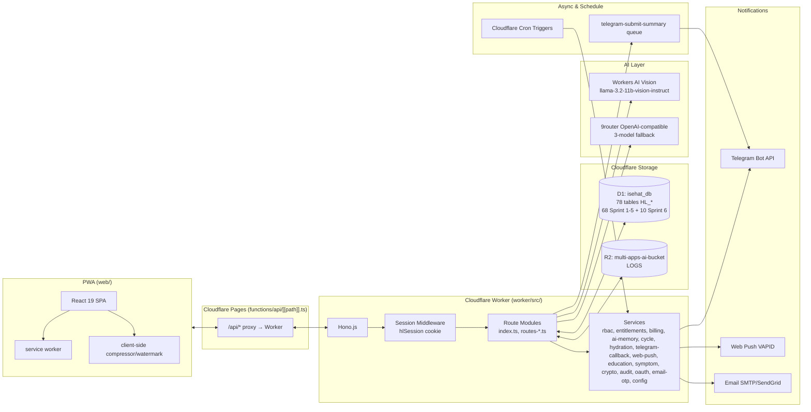
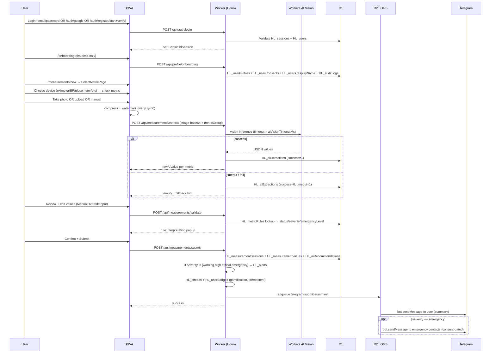
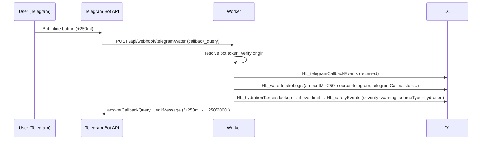
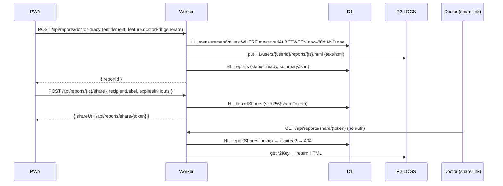

# ARCHITECTURE — iSehat

> **Dokumen ini dibuat berdasarkan audit langsung terhadap source code di repo (worker/, web/, docs/03.SQL_SCHEMA_*, docs_sprint5/04.SQL_SEED_*, worker/migrations/*).**
> Status: **Sprint 6 AI Clinical Copilot delivered (S6A–S6H ✅, S6I automated tests ✅). Closed beta + production rollout pending.**
> Dokumen lama: lihat `archive/docs_legacy_2025_sprint1-5/04-ARCHITECTURE.md`.

---

## 1. Overview

iSehat adalah aplikasi kesehatan digital yang berjalan 100% di stack Cloudflare. Pengguna dapat:

1. Login (email/password lokal, OTP email, OAuth Google) lalu menyelesaikan onboarding profile.
2. Mengukur tanda vital (tekanan darah, glukosa, kolesterol, asam urat, SpO2, berat, dll) lewat foto, upload, atau input manual.
3. Mendapat ekstraksi nilai via **Workers AI Vision** (`@cf/meta/llama-3.2-11b-vision-instruct`), dengan **manual override** wajib.
4. Validasi nilai lewat **`HL_metricRules`** (rule-first, AI-assisted).
5. Submit pengukuran, simpan lampiran (compressed + watermarked webp) ke **R2**, dan broadcast via **Telegram** (submit summary & emergency alert).
6. Melihat dashboard (today / weekly / monthly / comparison / daily-health-hub) dan laporan (daily / weekly / monthly / doctor-ready 30 hari, share token).
7. Mengatur keluarga/caregiver (RBAC), kontak darurat (encrypted, dengan consent), pengingat minum obat, pattern detection (sleep↔BP, weight↔BP, medication).
8. Menggunakan fitur Sprint 5: Hydration tracker, Cycle tracking (dengan guardrail), AI Assistant (premium, dengan medical safety filter), Education cards, Symptom logging, Family-sensitive permissions, Xendit/Mock billing, AI Memory (Vectorize-ready infrastructure).
9. Menggunakan fitur Sprint 6: AI Clinical Copilot (clinical chat, symptom interview, possible explanations), Medical Safety Runtime v2 (13 detectors), AI Gateway + 9router model routing, Vectorize runtime (index/query/rebuild), First Aid Guidance Engine, Emergency Guidance (deterministic), WhatsApp AI via Baileys, Doctor Handoff v2, Admin AI Governance, AI Operating Mode management.

Prinsip desain:

```text
Rule-first, AI-assisted        — severity/emergency SELALU dari HL_metricRules. AI boundary depends on operating mode (standard/proactive/super_aktif).
Manual-verification-first      — setiap nilai AI wajib bisa di-override.
Cloudflare-native              — Workers (4) + D1 + R2 + Queues + Cron + Workers AI + Vectorize + AI Gateway + AI Search + KV + Durable Objects.
Free-tier-conscious            — kompres + watermark di client, no original image, OCR rate-limited, Vectorize free tier 500 vectors/user.
Mobile-first, PWA-ready        — Service worker + manifest + bottom-nav + FAB.
Medical-safety                 — AI boundary mode-dependent (§0.3 PRD S6); Safety Runtime 13 detectors; medicationChangeDetector ALWAYS blocks; emergency severity never downgraded by AI.
Privacy-by-design              — sensitive field encrypted (AES-GCM enc:v1:); no plaintext secret di D1/log/bundle; cross-user leak blocked; consent-gated data access.
Multi-worker                   — 4 Workers: #1 API, #2 AI, #3 Jobs/Cron, #4 Webhooks. Service Bindings for internal communication.
```

---

## 2. Stack & Bindings

### 2.1 Runtime

| Layer | Tech | Source |
|---|---|---|
| Frontend | React 19 + Vite + TypeScript | `web/` (npm workspaces) |
| PWA | `public/manifest.json` + `public/sw.js` + bottom-nav | `web/src/App.tsx`, `web/src/main.tsx` |
| API Gateway | Hono.js di Cloudflare Workers (#1) | `worker/apps/src/index.ts` + `routes-*.ts` |
| AI Worker | Hono.js di Cloudflare Workers (#2) | `worker/ai/src/index.ts` + `services/` |
| Jobs Worker | Cloudflare Workers (#3) | `worker/cron/src/index.ts` |
| Webhooks Worker | Hono.js di Cloudflare Workers (#4) | `worker/webhook/src/index.ts` |
| Database | Cloudflare D1 → `DB` binding `isehat_db` | `worker/wrangler.toml` |
| Object storage | Cloudflare R2 → `LOGS` binding `multi-apps-ai-bucket` | `worker/wrangler.toml` |
| Vectorize | Free Tier → `VECTORIZE_INDEX` binding `hl-health-memory` | `worker/ai/wrangler.toml` |
| AI Gateway | REST API (CLOUDFLARE_ACCOUNT_ID + CLOUDFLARE_API_TOKEN) | `worker/ai/src/services/modelRouter.ts` |
| KV Cache | `AI_KV` binding | `worker/ai/wrangler.toml` |
| Durable Objects | AiChatSessionDO, WhatsAppSessionDO, UserAiLockDO, ModelStreamingDO, JobProgressDO | `worker/ai/wrangler.toml` |
| Queue producer/consumer | `TELEGRAM_QUEUE` → `telegram-submit-summary`; `AI_MEMORY_QUEUE` → `ai-memory-jobs`; `whatsapp-outbound`; `eval-jobs` | `worker/wrangler.toml`, `worker/cron/wrangler.toml` |
| Scheduler | Cloudflare Cron Triggers (`scheduledHandler`) di #3 | `worker/cron/src/index.ts` |
| AI Vision | `@cf/meta/llama-3.2-11b-vision-instruct` (Workers AI binding `AI` di #2) | configurable via `HL_systemConfigs` |
| AI Text | AI Gateway → 9router (custom provider), 3-model fallback; Workers AI fallback | `worker/ai/src/services/modelRouter.ts` |
| Embedding | `@cf/baai/bge-base-en-v1.5` (768-dim, free) | `worker/ai/wrangler.toml` |
| Auth | HTTP-only cookie `hlSession` + `D1` `HL_sessions` | `worker/apps/src/routes-auth.ts::getCurrentSession` |
| OAuth | Google OAuth 2.0 (`/api/auth/google*`) | `routes-auth.ts` |
| Email | Email OTP via `email-otp.ts` + `email-sender.ts` | `routes-auth.ts` |
| WhatsApp | Baileys gateway on VPS/Node.js → Cloudflare Tunnel → Worker #4 | `worker/webhook/src/index.ts` |

### 2.2 Bindings — 4 Worker Topology

```text
═══════════════════════════════════════════════════════════════
Worker #1: isehat-api-worker  (worker/apps/)
═══════════════════════════════════════════════════════════════
  D1: DB (isehat_db, d777e991-ddc9-4072-8522-06cb08a6538c)
  R2: LOGS (multi-apps-ai-bucket)
  Queues: TELEGRAM_QUEUE (telegram-submit-summary), AI_MEMORY_QUEUE (ai-memory-jobs)
  Service Binding: AI_SERVICE → isehat-ai-worker

═══════════════════════════════════════════════════════════════
Worker #2: isehat-ai-worker  (worker/ai/)
═══════════════════════════════════════════════════════════════
  D1: DB (isehat_db, same as #1)
  Vectorize: VECTORIZE_INDEX (hl-health-memory, free tier)
  KV: AI_KV (id=59ba33a4d92a4e0c852c9df6c63b11e9)
  Workers AI: AI (embedding @cf/baai/bge-base-en-v1.5, vision)
  Durable Objects: AiChatSessionDO, WhatsAppSessionDO, UserAiLockDO, ModelStreamingDO, JobProgressDO
  Queues: whatsapp-outbound (producer)

═══════════════════════════════════════════════════════════════
Worker #3: isehat-jobs-worker  (worker/cron/)
═══════════════════════════════════════════════════════════════
  D1: DB (isehat_db, same as #1)
  R2: LOGS (multi-apps-ai-bucket)
  Queues: consumer for (telegram-submit-summary, ai-memory-jobs, whatsapp-outbound, eval-jobs)
  Cron: 6 scheduled jobs (expire sessions, nullify encrypted, delete messages, archive model runs, delete vectors, archive safety flags)

═══════════════════════════════════════════════════════════════
Worker #4: isehat-webhooks-worker  (worker/webhook/)
═══════════════════════════════════════════════════════════════
  R2: LOGS (multi-apps-ai-bucket — for WA media)
  Service Bindings: API_SERVICE → #1, AI_SERVICE → #2, JOBS_SERVICE → #3
```

### 2.3 Secrets (Cloudflare env, NEVER di D1 / seed / log)

```text
ENCRYPTION_KEY              — AES-GCM key (≥16 char) untuk data sensitif.
CRON_SECRET                 — bearer token untuk /api/internal/cron/*.
TELEGRAM_BOT_TOKEN          — fallback kalau HL_systemConfigs.telegramBotToken kosong.
VAPID_PRIVATE_KEY           — Web Push (optional).
GOOGLE_OAUTH_CLIENT_ID      — Google OAuth (Sprint 5A).
GOOGLE_OAUTH_CLIENT_SECRET  — Google OAuth.
OAUTH_REDIRECT_BASE_URL     — base URL callback.
XENDIT_SECRET_KEY           — billing (Sprint 5F/X).
XENDIT_WEBHOOK_SECRET       — billing webhook verification.
EMAIL_SMTP_* / SENDGRID_*   — email OTP delivery (configurable).
CLOUDFLARE_ACCOUNT_ID       — AI Gateway REST API (S6B).
CLOUDFLARE_API_TOKEN        — AI Gateway auth (S6B).
WA_GATEWAY_SECRET           — WhatsApp Baileys webhook auth (S6G).
CLINICAL_MESSAGE_ENCRYPTION_KEY — AES-GCM key untuk clinical message content encryption (S6E).
9ROUTER_API_KEY              — 9router text AI API key (S6B).
```

D1 menyimpan HANYA **referensi/metadata** (`HL_configMetadata.storageMode ∈ {'d1','env','secret','reference'}`). Plaintext secret TIDAK boleh ada di `HL_systemConfigs`.

---

## 3. Naming Conventions

```text
Table prefix: HL_
No extra underscore after HL_
Field names: camelCase
Constraint ENUMs: lower camel or kebab-case as defined in CHECK
JSON columns: payloadJson / summaryJson / dataJson / metadataJson / configurationJson
```

Valid: `HL_users`, `HL_userProfiles`, `HL_measurementSessions`, `userId`, `createdAt`, `finalValue`, `manualOverride`.
Invalid: `users`, `HL_user_profiles`, `created_at`, `manual_override`, `HL_educationViews` (dilarang — lihat `HL_userEducationProgress`).

---

## 4. High-Level Architecture



---

## 5. Project Layout (Actual)

```text
health/
├── docs/                              # dokumen final Sprint 1-5
│   ├── 04-ARCHITECTURE.md             # file ini
│   ├── 05-api-contract.md             # API contract (updated to Sprint 6)
│   ├── 06-design-system.md            # design system (updated to Sprint 6)
│   ├── 07-schema.sql                  # Sprint 1-4 baseline D1 schema
│   ├── 08-seed.sql                    # Sprint 1-4 baseline seed
│   ├── 03.SQL_SCHEMA_SPRINT5_FINAL_REVISED_AI_SPRINT6_READY.sql
│   └── 01-02.PRD_*.md                # Sprint 5 PRD + user stories
├── docs_sprint6/                      # Sprint 6 working docs
│   ├── 01.PRD_S6_AI_CLINICAL_COPILOT.md  # Master PRD (S6A-I, status: S6A-H ✅)
│   ├── 02-10.PRD_S6A-S6I_*.md        # Per-phase sub-PRDs
│   ├── TASK_PLAN_SPRINT6_AI.md        # Task plan + dependency
│   ├── AI_SAFETY_RUNTIME_SPEC.md     # 13 detector specifications
│   ├── CLINICAL_RESPONSE_SCHEMA.md   # Response format, answerType
│   ├── PROMPT_GUARDRAIL_SPEC.md      # Prompt templates, versioning
│   ├── VECTORIZE_MEMORY_SCHEMA.md    # Namespace, vector structure
│   ├── DATA_PRIVACY_CONSENT_MATRIX.md # Consent gates, sensitive data
│   ├── WHATSAPP_BAILEYS_ARCHITECTURE.md # WA gateway, VPS, DO
│   ├── EVAL_DATASET_SPEC_SPRINT6.md  # Evaluation cases, scoring
│   ├── TEST_PLAN_SPRINT6_AI_SAFETY.md # Test coverage per phase
│   └── USER_STORIES_SPRINT6_AI.md    # User-facing acceptance criteria
├── worker/                            # 4-Worker monorepo (npm workspaces)
│   ├── apps/                          # Worker #1: isehat-api-worker
│   │   ├── wrangler.toml              # binding DB / LOGS / queues / AI_SERVICE
│   │   ├── src/
│   │   │   ├── index.ts               # Main router + Sprint 1-5 routes
│   │   │   ├── routes-admin.ts        # Admin core + S6H governance endpoints
│   │   │   ├── routes-ai.ts           # AI proxy routes + S6E clinical proxy
│   │   │   ├── routes-auth.ts         # Auth, OTP, OAuth, symptoms, education
│   │   │   ├── routes-cycle.ts        # Cycle tracking + family permissions
│   │   │   ├── routes-extra.ts        # Extra Sprint 1-5 features
│   │   │   ├── routes-hydration.ts    # Hydration tracker
│   │   │   ├── routes-telegram.ts     # Telegram webhook + hydration cron
│   │   │   ├── routes-whatsapp.ts     # S6G WA link/status/unlink
│   │   │   └── services/             # Sprint 1-5 services (22 modules)
│   │   └── test/                      # 370+ tests (S1-5 + S6H + S6I)
│   ├── ai/                            # Worker #2: isehat-ai-worker (NEW Sprint 6)
│   │   ├── wrangler.toml              # binding DB / VECTORIZE_INDEX / AI_KV / AI / DO / queues
│   │   ├── src/
│   │   │   ├── index.ts               # 19 routes: clinical, memory, context, safety
│   │   │   ├── services/
│   │   │   │   ├── clinicalOrchestrator.ts  # Core AI flow + encryption
│   │   │   │   ├── safetyRuntime.ts   # 13-detector v2 engine
│   │   │   │   ├── detectors.ts        # Individual detector implementations
│   │   │   │   ├── modelRouter.ts      # AI Gateway + 9router + fallback
│   │   │   │   ├── contextPackageBuilder.ts  # D1 + Vectorize + AI Search assembly
│   │   │   │   ├── firstAidEngine.ts   # Protocol lookup + AI Search + fallback
│   │   │   │   ├── vectorizeService.ts # Index, query, rebuild, delete
│   │   │   │   ├── quotaService.ts     # Plan quota consumption
│   │   │   │   └── whatsappSessionDo.ts # WhatsApp DO + truncate
│   │   │   └── types.ts               # Bindings, types
│   │   └── test/                      # 523+ tests (S6A-S6F)
│   ├── cron/                           # Worker #3: isehat-jobs-worker (NEW Sprint 6F)
│   │   ├── wrangler.toml              # cron triggers + queue consumers
│   │   ├── src/index.ts               # 6 cron jobs + queue handlers
│   │   └── test/                      # 6 tests
│   ├── webhook/                        # Worker #4: isehat-webhooks-worker (NEW Sprint 6G)
│   │   ├── wrangler.toml              # Service Bindings to #1/#2/#3
│   │   ├── src/index.ts               # WA/Telegram/Xendit wildcard webhook
│   │   └── test/                      # S6G tests
│   └── migrations/
│       ├── 001-005                    # Sprint 5 + early S6 migrations
│       ├── 003_sprint6_schema.sql     # 10 Sprint 6 tables
│       ├── 006_s6e_clinical_sessions.sql
│       ├── 007_s6g_whatsapp_uniqueness.sql
│       └── 008_s6h_governance.sql     # HL_aiEvaluationCases + HL_aiEvaluationRuns
├── web/                               # React 19 PWA
│   ├── src/
│   │   ├── App.tsx                    # SPA shell, 47+ pages, nav groups
│   │   ├── pages/                     # All page components
│   │   ├── components/                # 22+ components
│   │   ├── i18n/                      # ID/EN locale files (25+)
│   │   └── styles/                    # senior-mode, high-contrast
│   └── ...
├── HANDOFF_SPRINT6.md                 # Sprint 6 resume state
├── WORK_LOG_SPRINT6.md                # Sprint 6 execution log
└── AGENTS.md                          # Agent rulebook (Sprint 6)
```

---

## 6. Core Principles

### 6.1 Rule First, AI Assisted

Severity/emergency SELALU dari `HL_metricRules` (lihat `worker/src/index.ts::measurements/submit`). AI text (9router) dipakai untuk **narrative, summary, comparison** saja; AI vision untuk ekstraksi nilai. Pipeline:

```text
finalValue
  → physical validation (HL_metricCatalog.physicalMin/Max)
  → HL_metricRules lookup by (metricCode, sex, ageMin/Max, minValue/maxValue, status)
  → status / severity / emergencyLevel
  → HL_alerts row (kalau severity ∈ {warning,high,critical,emergency})
  → HL_safetyEvents row (Sprint 5 non-metric guardrails — symptom red flag, overhydration, cycle irregularity)
  → in-app notification + Telegram + optional caregiver
```

AI Vision timeout: configurable di `HL_systemConfigs.aiVisionTimeoutMs` (default 5000). Timeout / parse-fail → fallback manual input; TIDAK memblokir submit. AI Text mengikuti model fallback order di `aiTextModels` (comma-separated atau JSON array). `FORBIDDEN_PHRASES` di `index.ts` (resep obat, dosis, dll) — kalau AI output mengandung kata terlarang → replaced dengan fallback safe + `safetyStatus='filtered'`.

### 6.2 Original Image Is Not Stored

Alur upload lampiran di `routes-extra.ts` + frontend `AttachmentUploader.tsx`:

```text
User takes photo
  → FE kompres (webp, quality 50) + watermark (timestamp + username)
  → POST /api/measurements/attachments/upload (multipart)
  → Worker maxUploadSizeBytes check (configurable)
  → R2 put HL/users/{userId}/measurements/{sessionId}/{metricCode}-{ts}.webp
  → HL_measurementAttachments row (watermarked=1, compressed=1, compressionQuality=50)
  → HL_measurementSessions.hasAttachment=1
```

Dilarang keras: simpan original ke R2, simpan base64 ke D1, simpan unwatermarked image.

### 6.3 Onboarding Profile Gate

User baru WAJIB `POST /api/profile/onboarding` sebelum akses dashboard (`App.tsx::AppRoutes`). Worker:

1. Validasi `hlSession` cookie.
2. Validasi fields (sex ∈ male/female/other, heightCm > 0, birthDate valid, timezone valid).
3. Upsert `HL_userProfiles`, `HL_userConsents` (aiConsent, dataShareConsent, emergencyConsent), `HL_users.displayName`.
4. Append `HL_auditLogs` action=`profileOnboardingComplete`.
5. FE panggil `GET /api/auth/me` lagi → `requiresOnboarding=false` → redirect ke `/dashboard`.

### 6.4 Free-Tier Efficiency

```text
Client-side image compression + watermark       (web/src/utils/imageCompressor, watermark)
Configurable AI Vision timeout                  (HL_systemConfigs.aiVisionTimeoutMs)
Configurable OCR rate limit                     (HL_systemConfigs.ocrRateLimitMax, ocrRateLimitWindowMin)
Dashboard uses 48h window + JS-side tz filter   (routes/index.ts::dashboard/today)
Configurable cron secret + cron batch           (routes-extra.ts::scheduledHandler)
Sensitive data encrypted at rest                (services/crypto.ts, ENCRYPTION_KEY)
Sprint 5 safety events use HL_safetyEvents      (bukan HL_alerts)
Sprint 5 AI context fields use HL_aiRecommendationContexts  (bukan ALTER HL_aiRecommendations)
```

### 6.5 Sensitive Data Encryption

`worker/src/services/crypto.ts` — AES-GCM via `ENCRYPTION_KEY` (SHA-256 derived key). Format ciphertext: `enc:v1:{base64url(iv)}:{base64url(cipher)}`. Legacy plaintext tetap readable sampai di-migrasi. Encrypted fields (saat ini):

```text
HL_telegramLinks.telegramChatId
HL_emergencyContacts.contactName, contactPhone, telegramChatId
HL_medicationLogs.note
HL_measurementSessions.notes (where applicable)
```

### 6.6 No Hardcoded Configurations

Semua angka yang bisa berubah baca dari `HL_systemConfigs` lewat `services/config.ts` (TTL 5 menit, in-memory `Map<DB, Map<key, {value, expiresAt}>>`):

```text
aiVisionTimeoutMs               — AI Vision timeout (default 5000)
aiTextEndpoint                  — base URL OpenAI-compatible
aiTextModels                    — JSON array atau comma-separated
aiTextDefaultModel              — default model name
aiTextApiKey                    — bearer token (D1 reference only; real secret di env)
maxUploadSizeBytes              — batas upload lampiran (default 2 MB)
ocrRateLimitMax                 — OCR per user per window
ocrRateLimitWindowMin           — window (menit)
telegramBotToken                — bot token (reference)
telegramBotActive               — '1'/'0' toggle
clinicalCopilotEnabled          — Sprint 5 SELALU false; Sprint 6 toggle
```

Cache invalidation: `invalidateSystemConfig(db)` dipanggil setelah admin update.

---

## 7. Main User Flows

### 7.1 Capture a Measurement



### 7.2 Hydration Quick-Add (Telegram)



### 7.3 Doctor-Ready PDF (HTML to R2)



---

## 8. RBAC, Plans, and Entitlements

```text
HL_users ──< HL_userRoles >── HL_roles
                          └──< HL_rolePermissions >── HL_permissions

HL_users ──< HL_subscriptions >── HL_plans
                          └──< HL_planFeatures >── (featureCode)

HL_usageCounters (userId, featureCode, usageWindow, usedCount, quotaLimitSnapshot, resetAt)

services/rbac.ts::requirePermission(userId, code)            → checks HL_userRoles + HL_rolePermissions
services/entitlements.ts::requireEntitlement(db, userId, featureCode)
                                                              → checks HL_subscriptions.status + HL_planFeatures + HL_usageCounters
```

Roles (seeded, systemRole=1):
`user`, `support`, `admin`, `superAdmin`, `billingAdmin`, `aiConfigAdmin`, `medicalReviewer`.

Plans (seeded): `free`, `premiumMonthly`, `premiumQuarterly`, `premiumYearly`, `familyPremium`.

Fitur yang di-gate per-plan (lihat `docs_sprint5/04.SQL_SEED_…`):

| Feature | free | premiumMonthly | familyPremium |
|---|---|---|---|
| `feature.symptomLog.use` | ✓ unlimited | ✓ | ✓ |
| `feature.hydration.use` | basic | advanced | advanced |
| `feature.aiAssistant.use` | 3 / month | 100 / month | 100 / month |
| `feature.aiReport.use` | ✗ | 30 / month | 30 / month |
| `feature.doctorPdf.generate` | ✗ | 10 / month | 10 / month |
| `feature.vectorMemory.use` | ✗ | ✓ (infra only, Sprint 6 ready) | ✓ |
| `feature.aiClinicalCopilot.use` | ✗ | ✗ (Sprint 6 placeholder) | ✗ |
| `feature.telegramReminder.use` | ✗ | ✓ | ✓ |
| `feature.familyDashboard.use` | ✗ | ✗ | ✓ |
| `feature.cycleTracking.use` | ✗ | ✓ | ✓ |
| `feature.advancedHistory.use` | 30 day retention | unlimited | unlimited |
| `feature.exportFull.use` | ✗ | ✓ | ✓ |
| `feature.medicationReminder.use` | 3 lifetime | unlimited | unlimited |
| `feature.fastingInsight.use` | ✗ | ✓ | ✓ |

API `ENTITLEMENT_REQUIRED` (403) ketika user Free akses fitur paid.

---

## 9. Medical & Privacy Safety (Sprint 5 + Sprint 6 Hard Boundaries)

```text
Sprint 5 non-metric safety events  → HL_safetyEvents  (BUKAN HL_alerts).
Sprint 5 AI context fields         → HL_aiRecommendationContexts (BUKAN ALTER HL_aiRecommendations).
Education progress                 → HL_userEducationProgress (BUKAN HL_educationViews).
No plaintext secret                → D1 / seed / frontend / API response / log / audit metadata.
Real secrets                       → Cloudflare Secrets / Env. D1 hanya configured/masked/envVarName/secretRef.
Admin mutations                    → HL_auditLogs(userId, action, entityType, entityId, metadataJson).
Auth, RBAC, entitlement, quota, family permission,
cycle eligibility, webhook, cron, red flag, disclaimer  → semua server-side.
Sprint 1-4 behavior                → tetap backward compatible.
Sprint 6 AI output                 → Medical Safety Runtime v2 (13 detectors, mode-dependent).
Cross-user data                    → crossUserLeakDetector SELALU blocks.
Operating mode                     → standard (default) | proactive | super_aktif. Super Admin controlled.
```

AI medical behavior (mode-dependent per PRD S6 §0.3):

```text
STANDARD mode (default):
  AI TIDAK BOLEH: diagnosis final, resep, dosis, klaim spesialis, ubah obat.
  Safety Runtime blocks: diagnosisFinalDetector, prescriptionDosageDetector, specialistClaimDetector.
  
PROACTIVE mode:
  AI BOLEH: diagnosis final.
  AI TIDAK BOLEH: resep, dosis, klaim spesialis, ubah obat.
  Safety Runtime blocks: prescriptionDosageDetector, specialistClaimDetector.
  
SUPER_AKTIF mode:
  AI BOLEH: diagnosis final, resep, dosis, klaim spesialis.
  AI TIDAK BOLEH: ubah obat.
  Safety Runtime blocks: medicationChangeDetector (ALWAYS active).

ALL modes:
  Emergency severity NEVER downgraded by AI (emergencySeverityDowngradeDetector).
  Disclaimer WAJIB on all medical output (missingDisclaimerDetector).
  Deterministic red flag precheck ALWAYS runs before LLM call.
  medicationChangeDetector ALWAYS blocks (all modes).
  Vectorize is semantic retrieval, NOT clinical proof (vectorizeAsTruthDetector).
```

---

## 10. AI Infrastructure (Sprint 6 Delivered)

```text
═══════════════════════════════════════════════════════════════
AI Gateway + 9router (Worker #2)
═══════════════════════════════════════════════════════════════
  Control plane: AI Gateway REST API
  URL: https://gateway.ai.cloudflare.com/v1/{accountId}/{gatewayId}/{provider}/chat/completions
  Primary: 9router custom provider (oc/deepseek-v4-flash-free default, oc/mimo-v2.5-free premium)
  Fallback: Workers AI (@cf/meta/llama-3.2-11b-vision-instruct for vision only)
  Secrets: CLOUDFLARE_ACCOUNT_ID, CLOUDFLARE_API_TOKEN (env, never D1)

═══════════════════════════════════════════════════════════════
Medical Safety Runtime v2 (Worker #2)
═══════════════════════════════════════════════════════════════
  13 detectors (§10.1 PRD S6):
  Mode-invariant (always active):
    1. missingDisclaimerDetector → block_and_fallback
    2. emergencySeverityDowngradeDetector → block_and_fallback
    3. crossUserLeakDetector → block_and_fallback
    4. sensitiveDataLeakDetector → block_and_fallback
    5. unsafeReassuranceDetector → rewrite_safe
    6. certaintyClaimDetector → rewrite_safe
    7. vectorizeAsTruthDetector → rewrite_safe
    8. ruleEngineBypassDetector → block_and_fallback
    9. delayMedicalCareDetector → block_and_fallback
    12. medicationChangeDetector → block_and_fallback (ALL modes)
  Mode-dependent:
    10. diagnosisFinalDetector → standard: rewrite_safe | proactive: allow | super_aktif: allow
    11. prescriptionDosageDetector → standard: rewrite_safe | proactive: rewrite_safe | super_aktif: allow
    13. specialistClaimDetector → standard: rewrite_safe | proactive: rewrite_safe | super_aktif: allow

  6 Safety Decisions: allow, allow_with_disclaimer, rewrite_safe, block_and_fallback, emergency_template_only, needs_human_review

═══════════════════════════════════════════════════════════════
Clinical Orchestrator (Worker #2)
═══════════════════════════════════════════════════════════════
  Flow: auth → consent → entitlement → intent classify → red flag precheck →
        D1 context → Vectorize query → AI Search → context package →
        prompt (mode-specific forbiddenActions) → model router →
        Safety Runtime → response formatter (disclaimer) → audit + model run log

  Output types: safe_summary, possible_explanations, follow_up_questions,
    missing_data, first_aid_guidance, emergency_guidance, doctor_handoff,
    caregiver_summary, medication_adherence_summary, medication_questions_for_doctor,
    blocked_unsafe_request

═══════════════════════════════════════════════════════════════
Vectorize Runtime (Worker #2 query, Worker #3 batch)
═══════════════════════════════════════════════════════════════
  Index: hl-health-memory (Free Tier, 768-dim)
  Namespace: user:{userId} (client cannot override)
  Embedding: @cf/baai/bge-base-en-v1.5 (768-dim, free)
  Per-user limit: 500 vectors default (configurable vectorize.maxVectorsPerUser)
  Alert threshold: 80% of 10M global limit (8M vectors)

═══════════════════════════════════════════════════════════════
Sprint 6 New Tables (10 tables)
═══════════════════════════════════════════════════════════════
  HL_aiClinicalSessions, HL_modelRuns, HL_aiClinicalMessages,
  HL_aiClinicalIntakeAnswers, HL_aiOutputSafetyFlags, HL_promptVersions,
  HL_whatsappLinks, HL_whatsappMessages, HL_firstAidProtocols,
  HL_aiKnowledgeDocuments
  + S6H evaluation tables: HL_aiEvaluationCases, HL_aiEvaluationRuns

═══════════════════════════════════════════════════════════════
Operating Mode (Super Admin controlled)
═══════════════════════════════════════════════════════════════
  3 modes: standard (default), proactive, super_aktif
  Config: clinicalCopilot.operatingMode
  Change: requires medical reviewer approval (if config requires)
  Downgrade to standard: skips reviewer
  Audit: action=aiOperatingModeChanged
  Rate: max 1 change per hour
```

---

## 11. Deployment (4 Workers)

```text
1. cd worker/apps && npx tsc -p tsconfig.json && npm test
2. cd worker/ai && npx tsc -p tsconfig.json && npm test
3. cd worker/cron && npx tsc -p tsconfig.json && npm test
4. cd worker/webhook && npx tsc -p tsconfig.json && npm test
5. wrangler d1 execute isehat_db --remote --file=migrations/003_sprint6_schema.sql
6. wrangler d1 execute isehat_db --remote --file=migrations/006_s6e_clinical_sessions.sql
7. wrangler d1 execute isehat_db --remote --file=migrations/007_s6g_whatsapp_uniqueness.sql
8. wrangler d1 execute isehat_db --remote --file=migrations/008_s6h_governance.sql
9. wrangler d1 execute isehat_db --remote --command="PRAGMA foreign_key_check;"
10. cd worker/apps && wrangler deploy
11. cd worker/ai && wrangler deploy
12. cd worker/cron && wrangler deploy
13. cd worker/webhook && wrangler deploy
14. cd ../web && npm run build && wrangler pages deploy dist
```

Deployed URLs:

| App | URL |
|---|---|
| Worker #1 (API) | `https://hl-health-companion-api.indiehomesungairaya.workers.dev` |
| Worker #2 (AI) | `https://isehat-ai-worker.indiehomesungairaya.workers.dev` (internal, Service Binding) |
| Worker #3 (Jobs) | `https://isehat-jobs-worker.indiehomesungairaya.workers.dev` (cron/queues only) |
| Worker #4 (Webhooks) | `https://isehat-webhooks-worker.indiehomesungairaya.workers.dev` |
| Pages Frontend | `https://app.isehat.biz.id` |

Pages proxy `/api/*` → Worker #1 via `functions/api/[[path]].ts`. Worker #1 proxies `/api/ai/clinical/*` → Worker #2 via Service Binding `AI_SERVICE`.

---

## 12. Multi-Agent Operating Rules

Lihat `AGENTS.md` + `HANDOFF_SPRINT6.md` + `WORK_LOG_SPRINT6.md`. Aturan penting untuk coding agent:

1. Baca `AGENTS.md` + `HANDOFF_SPRINT6.md` + 3–5 entry terakhir `WORK_LOG_SPRINT6.md` sebelum edit.
2. Source of truth order: PRD S6 → sub-PRDs → TASK_PLAN → spec docs → AGENTS.md → HANDOFF → WORK_LOG.
3. TDD: RED → GREEN → REFACTOR → SECURITY → LOG → NEXT.
4. Update `WORK_LOG_SPRINT6.md` + `HANDOFF_SPRINT6.md` setiap task cycle.
5. Sprint order: S6A → S6B → S6C → S6D → S6E → S6F → S6G → S6H → S6I → Release Gate.
6. NEVER invent table/endpoint/permission/feature codes not in PRD (anti-hallucination §0).
7. NEVER cast as `any` — use proper types.
8. Medical Safety Runtime 13 detectors MUST run on every AI output.
9. Operating mode standard=default, proactive, super_aktif — mode-dependent AI boundary.
10. No plaintext secrets. Real secrets in Cloudflare Secrets/Env only.
