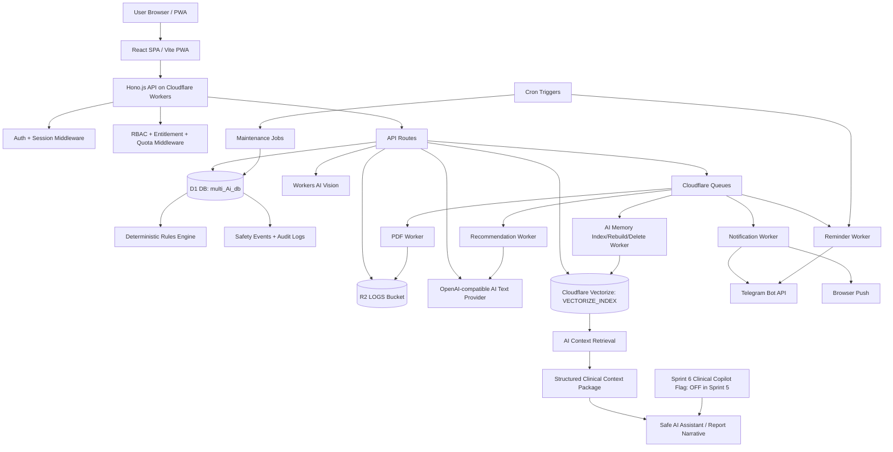
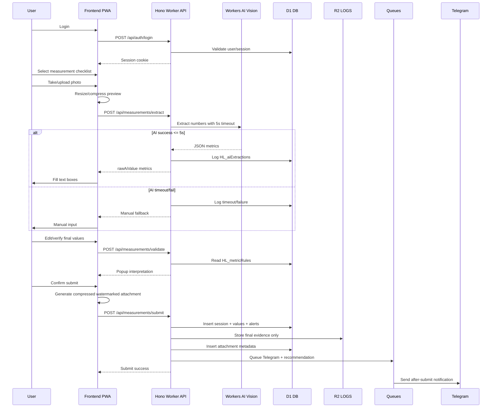
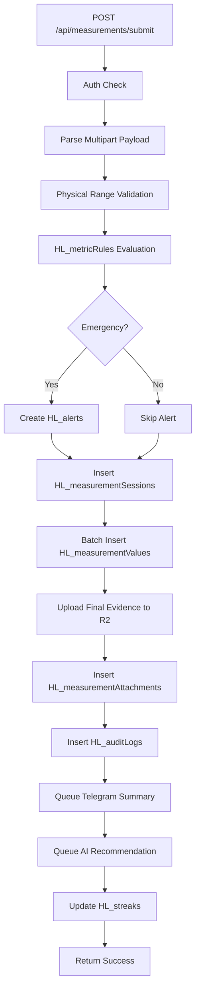
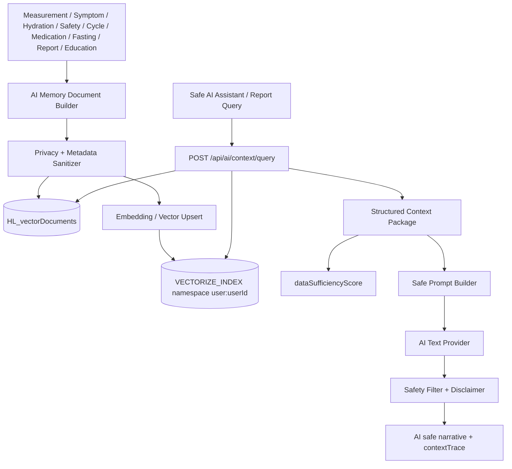
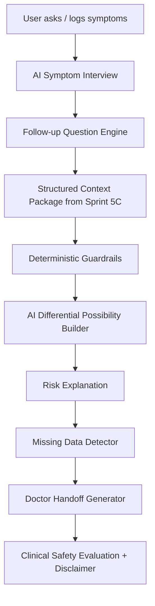

# ARCHITECTURE — HL Health Companion

```text
Document Type: Technical Architecture
Version: 2.1 FINAL REVISED — Sprint 5 AI Infrastructure + Sprint 6 Clinical Copilot Readiness
Date: 2026-06-24
Scope: Sprint 1–4 existing architecture + Sprint 5 Foundation/5A/5B/5C/5D/5E + Sprint 6 AI Doctor-like Clinical Copilot handoff architecture
Important Boundary: Sprint 5 does not ship AI doctor, final AI diagnosis, final AI emergency detector, prescription engine, medication dosage instruction, or medical oracle. Sprint 5C prepares AI Clinical Infrastructure and Vectorize foundation only. Sprint 6 may build the AI Doctor-like Clinical Copilot on top of these guardrails.
Related Revised Documents:
- PRD_SPRINT5_FULL_FINAL_REVISED_AI_SPRINT6_READY.md
- PRD_USER_STORIES_SPRINT5_FULL_FINAL_REVISED_AI_SPRINT6_READY.md
- API_CONTRACT_SPRINT5_FINAL_REVISED_AI_SPRINT6_READY.md
- SQL_SCHEMA_SPRINT5_FINAL_REVISED_AI_SPRINT6_READY.sql
- SQL_SEED_SPRINT5_FINAL_REVISED_AI_SPRINT6_READY.sql
- TASK_PLAN_SPRINT5_FULL_READY_REVISED_AI_SPRINT6_MOCKUP_PONYTAIL.md
- TEST_PLAN_SPRINT5_FULL_READY_REVISED_AI_SPRINT6_MOCKUP_READY.md
- STRESS_TEST_PLAN_SPRINT5_FULL_READY_REVISED_AI_SPRINT6_MOCKUP_READY.md
- TDD_PLAN_SPRINT5_FULL_READY_REVISED_AI_SPRINT6_MOCKUP_PONYTAIL_READY.md
- SPRINT5_FULL_MOCKUP_PRODUCTION_LAYOUT_AI_SPRINT6_READY.html
```


## 1. Overview

HL Health Companion is a full web health-monitoring application built on the Cloudflare stack.

The system helps users record health measurements from home health devices by taking or uploading photos, extracting values with Workers AI Vision when possible, allowing manual override, validating values with rule-based medical thresholds, saving final verified data, sending Telegram notifications, generating reports, and building dashboards for the user and caregiver.

The application is designed as:

```text
Rule-first
AI-assisted
Manual-verification-first
Clinical-infrastructure-first for Sprint 5C
AI Doctor-like Clinical Copilot-ready for Sprint 6
Cloudflare-native
Free-tier-conscious
Mobile-first
PWA-ready
```

### 1.1 Sprint 5 to Sprint 6 AI Scope Boundary

Sprint 5 is not the release where the product becomes an AI doctor. Sprint 5 prepares the architecture so a powerful AI Doctor-like Clinical Copilot can be built later without turning the current product into an unsafe or legally fragile medical oracle.

```text
Sprint 5C = AI Clinical Infrastructure & Vectorize Foundation
Sprint 6 = AI Doctor-like Clinical Copilot / Personal Health Intelligence
```

Sprint 5C may build:

```text
AI configuration
Vectorize binding and namespace isolation
AI memory metadata
context package builder
context trace
dataSufficiencyScore
server-side disclaimer enforcement
AI safety runtime
AI Clinical Copilot readiness endpoint
feature flag / runtime disabled state for Sprint 6
```

Sprint 5C must not ship:

```text
AI doctor
AI final diagnosis
AI final emergency detector
AI medical oracle
AI prescription engine
AI medication dosage instruction
AI autonomous clinical decision authority
```

Sprint 6 may build the AI Doctor-like Clinical Copilot experience on top of the Sprint 5C foundation:

```text
AI Symptom Interview
AI Follow-up Question Engine
AI Differential Possibility Builder
AI Risk Explanation
AI Missing Data Detector
AI Doctor Handoff Generator
AI Longitudinal Pattern Reasoning
AI Caregiver Summary
Clinical Safety Evaluation
```

Even in Sprint 6, deterministic rules remain the authority for emergency escalation, red flags, medication safety, privacy, consent, audit, and escalation.

---

## 2. Product Scope

The platform supports health tracking for:

```text
Pulse oximeter
Blood pressure monitor
Sinocare GCU glucose/cholesterol/uric acid device
Thermometer
Body scale
Manual sleep duration
Manual waist circumference
```

Supported health metrics:

```text
spo2
heartRate
systolic
diastolic
bloodPressurePulse
glucoseFasting
glucosePostMeal
cholesterolTotal
uricAcid
bodyWeight
bmi
waistCircumference
bodyTemperature
sleepDuration
height
```

Sprint 5 extends the product with the following release modules:

```text
Sprint 5 Foundation — Commercial Foundation & Admin Core
Sprint 5A — Daily Health Hub, Google OAuth, Education, Daily Symptom Log, Red Flag Interceptor
Sprint 5B — Hydration Tracker
Sprint 5C — AI Clinical Infrastructure & Vectorize Foundation
Sprint 5D — Cycle Tracking
Sprint 5E — Telegram Inline Hydration UX
```

Sprint 6 will use Sprint 5C infrastructure for:

```text
AI Doctor-like Clinical Copilot
AI clinical interview
longitudinal personal health reasoning
doctor-ready clinical handoff
caregiver-safe summary
```

---

## 2. Design Principles

### 2.6 No Hardcoded Configurations

Semua konfigurasi sistem yang bisa berubah (seperti batas memori 2MB, timeout AI 5000ms, limit API) **TIDAK BOLEH** di-hardcode di dalam kode.
Semuanya harus dibaca dari tabel `HL_systemConfigs` di D1. Untuk menghindari pengurasan kuota baca D1 (Cloudflare free tier), Worker harus melakukan *caching* (in-memory KV / Cache API) terhadap konfigurasi ini dengan masa berlaku tertentu (misalnya 5 menit).

### 2.7 Sensitive Data Encryption

Sensitive user data is encrypted at rest with AES-GCM using the Worker secret `ENCRYPTION_SECRET`. Encrypted values keep the existing schema columns and use the `enc:v1:` prefix. Read paths decrypt automatically, while legacy plaintext remains readable until migrated. Covered fields include Telegram chat IDs, emergency contact names/phones/Telegram IDs, medication log notes, and measurement session notes.

---

## 3. Required Cloudflare Stack

```text
Frontend: React SPA / Vite / PWA
Hosting: Cloudflare Pages or Workers Static Assets
API Gateway: Hono.js on Cloudflare Workers
Runtime: Cloudflare Workers TypeScript
Database: Cloudflare D1 binding DB
Object Storage: Cloudflare R2 binding LOGS
AI Vision: Cloudflare Workers AI Vision model
AI Text: OpenAI-compatible provider configured in `HL_systemConfigs` (`aiTextEndpoint`, `aiTextModels`, `aiTextDefaultModel`, optional secret reference for API key)
Vector Search: Cloudflare Vectorize binding `VECTORIZE_INDEX` for AI Clinical Infrastructure and Sprint 6 readiness
Async: Cloudflare Queues
Scheduler: Cloudflare Cron Triggers
Deployment: Wrangler
Notification: Telegram Bot API + Browser Push
PDF: HTML to PDF worker flow or external-compatible rendering strategy
```

Existing bindings:

```toml
[[d1_databases]]
binding = "DB"
database_name = "multi_Ai_db"
database_id = "b80ca989-6771-427f-a656-c7ab6ffc17ce"

[[r2_buckets]]
binding = "LOGS"
bucket_name = "multi-apps-ai-bucket"

[[vectorize]]
binding = "VECTORIZE_INDEX"
index_name = "hl-health-memory"
```

No new D1 database or R2 bucket should be created. Vectorize is used as an index/retrieval layer only; D1 remains the source of truth.

---

## 4. Naming Constraints

Database naming rules:

```text
Table prefix: HL_
No extra underscore after HL_
Field names: camelCase
```

Valid examples:

```text
HL_users
HL_userProfiles
HL_measurementSessions
HL_measurementValues
HL_metricRules
userId
createdAt
finalValue
manualOverride
```

Invalid examples:

```text
users
health_users
HL_user_profiles
created_at
manual_override
```

---

## 5. High-Level Architecture



Key architectural rule:

```text
D1 + deterministic rules decide status, severity, red flags, emergency escalation, entitlement, quota, and safety events.
Vectorize retrieves user-isolated context.
AI explains and summarizes safe context in Sprint 5.
Sprint 6 may add clinical interview/reasoning UX, but still behind deterministic guardrails.
```

---

## 6. Core Principles

## 6.1 Rule First, AI Assisted, Clinical-Copilot Ready

Medical status is always calculated from deterministic rules, not directly from AI.

```text
finalValue / symptom / hydration / cycle data
→ physical validation
→ deterministic rule / guardrail lookup
→ status / severity / emergencyLevel / warningCode / safetyEvent
→ structured context package
→ optional AI narrative or safe explanation
```

AI is allowed to help explain, summarize, compare, retrieve context, and prepare doctor-facing narratives. In Sprint 5, AI must not diagnose, prescribe medication, change medication dosage, override rule-based severity, or become the emergency authority.

Sprint 5C prepares clinical context infrastructure for Sprint 6. Sprint 6 may add AI Doctor-like Clinical Copilot experiences, but emergency escalation, red flag logic, medication safety, privacy, consent, and audit must remain deterministic/server-side.

---

## 6.2 Original Image Is Not Stored

Original photo is used only for temporary extraction.

```text
User takes photo
→ Browser preview/compress for extraction
→ Workers AI reads temporary file
→ Response fills text boxes
→ User verifies or edits value
→ User submits final values
→ Browser creates final compressed watermarked evidence image
→ Worker stores final evidence image only
```

Forbidden:

```text
Saving original photo to R2
Saving base64 image to D1
Saving unwatermarked evidence image
```

## 6.2.1 Onboarding Profile Gate

New users must complete `POST /api/profile/onboarding` before reaching the
dashboard. The Worker authenticates the existing `hlSession` cookie, validates
profile fields, writes `HL_userProfiles`, records AI consent in
`HL_userConsents`, updates `HL_users.displayName`, and appends a
`profileOnboardingComplete` audit log. The frontend refreshes
`GET /api/auth/me` after success so `requiresOnboarding` becomes `false` and the
SPA continues to `/dashboard`.

After onboarding, `GET /api/profile`, `PUT /api/profile`, and
`PUT /api/settings/ui` operate only on the authenticated user's existing
`HL_userProfiles` row. Profile updates validate height and timezone, UI updates
validate theme/accessibility enums, and both write `HL_auditLogs` entries. The
React app applies `profile.theme` to `data-theme` and
`profile.accessibilityMode` to `data-accessibility` on the document root after
auth refresh.

---

## 6.3 Fast Path First

AI must never block the user.

```text
AI extraction timeout: configurable via DB
If timeout: manual input fallback
If parse fails: manual input fallback
If AI unavailable: manual input fallback
```

OCR is synchronous for user interaction and not queued by default.

---

## 6.4 Free Tier Efficiency

The architecture is optimized to reduce D1 writes, R2 storage, AI calls, and queue overhead.

```text
Client-side image compression
Client-side watermarking
No original image storage
No automatic AI retry
Report PDF only on demand
Queues only for async non-blocking jobs
Dashboard uses indexed range queries
AI recommendations use compact summary JSON
Vectorize is called only when semantic/narrative retrieval is needed
No AI call for simple SQL aggregation or rule explanation that can be templated
```

---

## 6.5 Vectorize Usage Boundary

Vectorize is not a replacement for SQL. It is used only when semantic retrieval gives value that SQL aggregation cannot provide cleanly.

Use SQL/D1 for:

```text
latest value
average/min/max
date range trend
quota count
entitlement
rule threshold
report table
context trace ID lookup
```

Use Vectorize for:

```text
free-text symptom notes
longitudinal narrative memory
doctor report summaries
education knowledge retrieval
semantic search over historical episodes
Sprint 6 clinical intake and doctor handoff preparation
```

Forbidden:

```text
Do not call Vectorize just to calculate AVG, COUNT, MAX, MIN, latest, or simple rule status.
Do not store Vectorize documents without D1 metadata ownership.
Do not query cross-user namespaces.
Do not treat Vectorize result as clinical truth.
```

---

## 6.6 AI Clinical Copilot Runtime Boundary

Sprint 5 runtime must keep AI Doctor-like Clinical Copilot disabled.

```text
aiClinicalCopilotRuntimeEnabled = false
aiClinicalCopilotScopeStatus = deferred_to_sprint6
feature.aiClinicalCopilot.use = disabled for all plans in Sprint 5
```

If any client passes `clinicalCopilotMode=true` during Sprint 5, the API must return a deterministic rejection.

```json
{
  "success": false,
  "error": {
    "code": "AI_CLINICAL_COPILOT_DEFERRED",
    "message": "AI Clinical Copilot is deferred to Sprint 6."
  }
}
```

---

## 7. Main User Flow



---

## 8. Application Modules

## 8.1 Frontend Modules

```text
Auth UI
Onboarding UI
Measurement capture UI
Camera/upload component
Image compression service
Watermark canvas service
Manual override form
Interpretation popup
Dashboard today/weekly/monthly
Reports page
AI assistant page
Telegram settings page
Family/caregiver page
Medication tracker
Fasting timer
Gamification
Accessibility mode
PWA service worker
Admin shell
Daily Health Hub
Education bottom sheet
Daily symptom form
Emergency Blocking UI
Hydration widget and history
AI Memory settings
Context trace drawer
Sprint 6 Clinical Copilot readiness card disabled state
Cycle tracking calendar/settings/log
Cycle contraception guardrail modal
Telegram hydration settings
Premium upgrade and quota exceeded UI
```

## 8.2 Backend Modules

```text
Auth service
Session service
Profile service
Metric catalog service
Measurement service
AI extraction service
Rules engine
Attachment service
Dashboard query service
AI recommendation service
Telegram service
Notification service
Family RBAC service
Emergency alert service
Medication service
Fasting service
Report service
Pattern insight service
Gamification service
Knowledge base service
Audit log service
Rate limit service
Global RBAC service
Entitlement service
Quota service
Secret-safe config service
Education service
Symptom service
Red flag detector
Safety event service
Hydration target service
Water intake service
AI memory document builder
AI context query service
AI disclaimer service
Data sufficiency score service
Cycle eligibility/settings/calendar/log services
Cycle guardrail service
Telegram callback idempotency service
Sprint 6 AI Clinical Copilot readiness service
```

---

## 9. Suggested Repository Structure

```text
hl-health-companion/
├── apps/
│   ├── web/
│   │   ├── src/
│   │   │   ├── app/
│   │   │   ├── components/
│   │   │   ├── features/
│   │   │   ├── hooks/
│   │   │   ├── lib/
│   │   │   ├── pwa/
│   │   │   └── styles/
│   │   ├── public/
│   │   └── package.json
│   └── worker/
│       ├── src/
│       │   ├── index.ts
│       │   ├── env.ts
│       │   ├── routes/
│       │   ├── middleware/
│       │   ├── services/
│       │   ├── repositories/
│       │   ├── validators/
│       │   ├── queues/
│       │   ├── cron/
│       │   ├── ai/
│       │   ├── utils/
│       │   └── types/
│       ├── migrations/
│       │   └── schema.sql
│       ├── wrangler.toml
│       └── package.json
├── docs/
│   ├── PRD.md
│   ├── UserStories.md
│   ├── api-contract.md
│   └── ARCHITECTURE.md
└── package.json
```

---

## 10. Worker Runtime Architecture

## 10.1 Hono App Layout

```text
index.ts
→ create Hono app
→ request id middleware
→ security headers middleware
→ auth middleware
→ rate limit middleware
→ route registration
→ queue handlers
→ scheduled handlers
→ error handler
```

Example route grouping:

```text
routes/auth.ts
routes/profile.ts
routes/metrics.ts
routes/measurements.ts
routes/dashboard.ts
routes/ai.ts
routes/telegram.ts
routes/notifications.ts
routes/family.ts
routes/alerts.ts
routes/medications.ts
routes/fasting.ts
routes/reports.ts
routes/patterns.ts
routes/kb.ts
routes/settings.ts
routes/export.ts
routes/admin-users.ts
routes/admin-roles.ts
routes/admin-billing.ts
routes/admin-config.ts
routes/admin-feature-flags.ts
routes/admin-audit-safety.ts
routes/auth-google.ts
routes/education.ts
routes/symptoms.ts
routes/hydration.ts
routes/ai-context.ts
routes/ai-memory.ts
routes/admin-ai-memory.ts
routes/ai-clinical-copilot-readiness.ts
routes/cycle.ts
routes/telegram-water-webhook.ts
```

## 10.2 Environment Interface

```ts
export interface Env {
  DB: D1Database;
  LOGS: R2Bucket;
  AI: Ai;
  VECTORIZE_INDEX?: VectorizeIndex;

  SESSION_SECRET: string;
  ENCRYPTION_SECRET: string;
  TELEGRAM_BOT_TOKEN?: string;
  TELEGRAM_WATER_WEBHOOK_SECRET?: string;
  GOOGLE_OAUTH_CLIENT_SECRET?: string;
  AI_TEXT_API_KEY?: string;
  BILLING_WEBHOOK_SECRET?: string;
  INTERNAL_CRON_SECRET?: string;

  NOTIFICATION_QUEUE?: Queue;
  RECOMMENDATION_QUEUE?: Queue;
  PDF_QUEUE?: Queue;
  REMINDER_QUEUE?: Queue;
  AI_MEMORY_QUEUE?: Queue;
}
```

Environment rules:

```text
Secrets are read from Cloudflare Worker Secrets / env bindings.
Secret values are never stored in D1 plaintext.
HL_configMetadata may store configured/masked/envVarName metadata only.
VECTORIZE_INDEX is optional-safe in local/dev and must fallback gracefully if absent.
```

---

## 11. wrangler.toml Reference

```toml
name = "hl-health-companion"
main = "src/index.ts"
compatibility_date = "2026-06-20"

[ai]
binding = "AI"

[[d1_databases]]
binding = "DB"
database_name = "multi_Ai_db"
database_id = "b80ca989-6771-427f-a656-c7ab6ffc17ce"

[[r2_buckets]]
binding = "LOGS"
bucket_name = "multi-apps-ai-bucket"

[[vectorize]]
binding = "VECTORIZE_INDEX"
index_name = "hl-health-memory"

# Queue bindings are optional at early sprint stage.
# Add them when queues are created.
# [[queues.producers]]
# binding = "NOTIFICATION_QUEUE"
# queue = "hl-notification-queue"
#
# [[queues.consumers]]
# queue = "hl-notification-queue"
# max_batch_size = 10
# max_batch_timeout = 5

# [triggers]
# crons = ["*/30 * * * *", "0 1 * * *"]
```

---

## 12. Database Architecture

Primary database: Cloudflare D1 database `multi_Ai_db`.

The schema is normalized around sessions and values.

```text
HL_users
  └── HL_userProfiles
  └── HL_sessions
  └── HL_measurementSessions
        └── HL_measurementValues
        └── HL_measurementAttachments
        └── HL_alerts
        └── HL_aiRecommendations
```

### 12.1 Core Tables

```text
HL_users
HL_sessions
HL_userProfiles
HL_userConsents
HL_devices
HL_metricCatalog
HL_deviceMetrics
HL_metricRules
HL_measurementDrafts
HL_measurementSessions
HL_measurementValues
HL_measurementAttachments
HL_aiExtractions
HL_aiRecommendations
HL_alerts
HL_notifications
HL_auditLogs
HL_oauthAccounts
HL_userEducationProgress
HL_symptomLogs
HL_safetyEvents
HL_hydrationSettings
HL_hydrationTargets
HL_waterIntakeLogs
HL_vectorDocuments
HL_aiContextQueries
HL_aiRecommendationContexts
HL_aiMemoryJobs
HL_cycleSettings
HL_cycleLogs
HL_cycleGuardrailAcknowledgements
HL_telegramCallbackEvents
```

The measurement checklist is catalog-driven. `GET /api/metrics/catalog` reads
`HL_devices`, `HL_deviceMetrics`, and `HL_metricCatalog`, then the frontend
renders active device/metric rows without a hardcoded metric whitelist.

### 12.2 Notification and Sharing Tables

```text
HL_telegramLinks
HL_pushSubscriptions
HL_notificationSettings
HL_reminderSettings
HL_familyLinks
HL_familyInvites
HL_emergencyContacts
```

### 12.3 Advanced Feature Tables

```text
HL_medications
HL_medicationSchedules
HL_medicationLogs
HL_fastingSessions
HL_badges
HL_userBadges
HL_streaks
HL_reports
HL_reportShares
HL_patternInsights
HL_knowledgeArticles
HL_apiRateLimits
```

### 12.4 Sprint 5 Foundation Tables

```text
HL_roles
HL_permissions
HL_rolePermissions
HL_userRoles
HL_plans
HL_planFeatures
HL_subscriptions
HL_paymentEvents
HL_usageCounters
HL_featureFlags
HL_configMetadata
```

### 12.5 Sprint 5A Tables

```text
HL_oauthAccounts
HL_oauthStates
HL_educationCards
HL_userEducationProgress
HL_symptomLogs
HL_safetyEvents
```

### 12.6 Sprint 5B Tables

```text
HL_hydrationSettings
HL_hydrationTargets
HL_waterIntakeLogs
```

### 12.7 Sprint 5C AI Clinical Infrastructure Tables

```text
HL_vectorDocuments
HL_aiContextQueries
HL_aiRecommendationContexts
HL_aiMemoryJobs
```

D1 remains the source of truth. Vectorize stores embeddings/index entries only and must always be hydrated/authorized through D1 metadata.

### 12.8 Sprint 5D Tables

```text
HL_cycleSettings
HL_cycleLogs
HL_cycleGuardrailAcknowledgements
HL_familyPermissions
```

### 12.9 Sprint 5E Tables

```text
HL_telegramCallbackEvents
HL_waterIntakeLogs
HL_safetyEvents
```

Sprint 5 non-metric safety events must use `HL_safetyEvents`, not `HL_alerts`. `HL_alerts` remains for Sprint 1–4 measurement-centric alerts only.

---

## 13. Data Ownership Model

Every user-owned row must contain `userId` where possible.

Owner-scoped tables:

```text
HL_userProfiles
HL_measurementSessions
HL_measurementValues
HL_measurementAttachments
HL_aiExtractions
HL_aiRecommendations
HL_alerts
HL_notifications
HL_telegramLinks
HL_pushSubscriptions
HL_notificationSettings
HL_reminderSettings
HL_emergencyContacts
HL_medications
HL_medicationLogs
HL_fastingSessions
HL_userBadges
HL_streaks
HL_reports
HL_patternInsights
HL_auditLogs
HL_oauthAccounts
HL_userEducationProgress
HL_symptomLogs
HL_safetyEvents
HL_hydrationSettings
HL_hydrationTargets
HL_waterIntakeLogs
HL_vectorDocuments
HL_aiContextQueries
HL_aiRecommendationContexts
HL_aiMemoryJobs
HL_cycleSettings
HL_cycleLogs
HL_cycleGuardrailAcknowledgements
HL_telegramCallbackEvents
```

Access rule:

```text
Default: user can access only own userId rows.
Caregiver: access only if HL_familyLinks is active and permission allows it.
Doctor viewer: access only report share link, not full dashboard.
Emergency contact: receives alert only, no full dashboard by default.
```

---

## 14. R2 Storage Architecture

Bucket binding:

```text
LOGS = multi-apps-ai-bucket
```

### 14.1 Evidence Image Path

```text
HL/users/{userId}/measurements/{sessionId}/{metricCode}-{attachmentId}.webp
```

### 14.2 Report Path

```text
HL/users/{userId}/reports/doctorReady30d-{reportId}.pdf
```

### 14.3 Storage Rules

```text
R2 bucket is private
No public object URL
All access requires owner/caregiver permission check
Stream through Worker or generate short signed URL
Store only final compressed watermarked images
Never store raw original image
```

---

## 15. Measurement Data Model

A measurement session is one event, and it can contain many values.

Example:

```text
Session: 2026-06-20 20:15
Values:
- spo2 = 98 %
- heartRate = 73 bpm
- systolic = 142 mmHg
- diastolic = 91 mmHg
- bodyWeight = 78.4 kg
- bmi = 27.1 index
```

This avoids creating separate tables for each metric and makes dashboards easier.

---

## 16. Measurement Submit Flow Internals



Submit should be transactional for D1 operations where possible. R2 upload and D1 insert order should be handled carefully:

```text
Option A:
1. Upload R2 objects
2. Insert D1 rows
3. If D1 fails, delete uploaded R2 objects best effort

Option B:
1. Insert D1 session/values
2. Upload R2 objects
3. Insert attachments
4. If R2 fails, mark session hasAttachment false or return retryable error
```

Recommended for Sprint 1: Option A with best-effort cleanup.

---

## 17. AI Vision Architecture

### 17.1 AI Extraction Path

```text
POST /api/measurements/extract
→ auth check
→ rate limit check
→ validate deviceCode and selectedMetricCodes
→ read image into memory
→ call Workers AI Vision with strict JSON prompt
→ timeout at configured limit
→ parse JSON
→ validate against physical range
→ write HL_aiExtractions log
→ return metrics to frontend
```

### 17.2 Prompt Strategy

Use device-specific prompts.

```text
oximeter prompt
bloodPressure prompt
sinocareGcu prompt
thermometer prompt
bodyScale prompt
```

Never use one generic prompt for all devices.

### 17.3 AI Output Contract

```json
{
  "deviceCode": "yuwellYx106",
  "metrics": [
    {
      "metricCode": "spo2",
      "rawAiValue": 98,
      "unit": "%",
      "confidence": 0.89
    }
  ],
  "needsManualReview": false
}
```

### 17.4 Failure Handling

```text
Timeout → manual fallback
No JSON → manual fallback
Invalid value → manual fallback
Low confidence → fill value but mark needsManualReview true
```

---

## 18. AI Recommendation Architecture

AI recommendation runs after submit and should not block the user.

```text
Submit success
→ queue generateRecommendation
→ worker builds compact summary
→ calls Workers AI text model
→ safety filter response
→ save to HL_aiRecommendations
```

### 18.1 Summary Input

Text AI provider configuration is DB-backed. Worker resolves `aiTextEndpoint`, `aiTextModels`, `aiTextDefaultModel`, and optional `aiTextApiKey` from `HL_systemConfigs`. The current seed points to the 9router OpenAI-compatible endpoint and tries the configured model list in order before falling back to deterministic safe text.

The LLM should receive only compact, relevant data:

```json
{
  "today": {},
  "threeDayComparison": {},
  "sevenDayComparison": {},
  "ruleStatuses": [],
  "emergencyFlags": []
}
```

### 18.2 Safety Filter

Reject or fallback if AI output contains:

```text
hard diagnosis
medication prescription
dosage change instruction
claim of certainty
panic-inducing emergency statement not supported by rules
AI doctor / AI diagnosis / AI prescription / AI dosage instruction
```

### 18.3 Sprint 5C AI Clinical Infrastructure Architecture

Sprint 5C replaces the old concept of "AI Memory as a user-facing AI feature" with infrastructure for Sprint 6.



Core services:

```text
AiMemoryDocumentBuilder
VectorDocumentMetadataService
AiMemoryJobService
AiContextQueryService
AiRecommendationContextBridge
AiDisclaimerService
DataSufficiencyScoreService
AiClinicalCopilotReadinessService
```

Key rules:

```text
namespace = user:{userId}
client cannot override userId
contextTrace must hide sensitive detail beyond safe preview
delete memory removes vector + metadata, not source D1 health data
rebuild is idempotent
Vectorize unavailable returns safe fallback
AI output always includes server-side disclaimer
```

### 18.4 Context Package Architecture

Sprint 5C should prepare structured clinical context packages so Sprint 6 AI does not read random raw data without boundaries.

```json
{
  "userContext": {
    "profileSummary": {},
    "timezone": "Asia/Jakarta",
    "permissions": {}
  },
  "deterministicStatus": {
    "latestMeasurements": [],
    "ruleStatuses": [],
    "safetyEvents": [],
    "redFlags": []
  },
  "longitudinalContext": {
    "measurementTrends": [],
    "symptomEpisodes": [],
    "hydrationPatterns": [],
    "cycleContext": {},
    "medicationAdherence": [],
    "fastingContext": []
  },
  "retrievedMemory": {
    "usedVectorContext": true,
    "contextTrace": []
  },
  "quality": {
    "dataSufficiencyScore": 72,
    "scoreReason": "Enough BP and symptom history, medication adherence incomplete."
  },
  "safety": {
    "allowedActions": [],
    "forbiddenActions": [
      "diagnosis_final",
      "emergency_authority",
      "prescription",
      "dosage_instruction"
    ]
  }
}
```

`dataSufficiencyScore` replaces any misleading `patternScore` or `clinicalConfidenceScore` language. It measures data completeness/evidence quality, not diagnosis confidence.

### 18.5 Sprint 6 AI Doctor-like Clinical Copilot Target Architecture

Sprint 6 may introduce a clinical copilot layer, but it must consume Sprint 5 context packages and safety outputs rather than raw database rows.



Sprint 6 must still block these behaviors unless a future regulated/validated path explicitly allows them:

```text
final diagnosis
autonomous emergency decision
prescription
medication dosage change
claiming to replace doctors
claiming medical certainty from correlation
```

---

## 19. Rules Engine Architecture

Rules are stored in:

```text
HL_metricRules
```

### 19.1 Rule Lookup

Input:

```text
metricCode
finalValue
unit
sex
age
```

Lookup algorithm:

```text
1. Validate physicalMin/physicalMax from HL_metricCatalog
2. Find active HL_metricRules by metricCode
3. Prefer exact sex rule if requiresSex
4. Fallback to sex = all
5. Filter ageMin <= age <= ageMax
6. Filter minValue <= finalValue <= maxValue
7. Sort by rulePriority ASC
8. Return first rule
9. If no rule found, return fallback status info
```

### 19.2 Blood Pressure Composite Handling

Systolic and diastolic are stored separately but displayed together.

Composite status should use highest severity between:

```text
systolic severity
diastolic severity
```

Emergency if either:

```text
systolic emergencyLevel = emergency
diastolic emergencyLevel = emergency
```

---

## 20. Notification Architecture

### 20.1 Channels

```text
inApp
telegram
browser
email optional later
```

### 20.2 Telegram After Submit

Every successful submit can enqueue Telegram summary if enabled.

```text
Measurement submit
→ create HL_notifications pending
→ queue telegramSubmitSummary
→ queue consumer sends Telegram
→ update HL_notifications status sent/failed
```

Submit response must not wait more than 1000 ms for notification logic.

### 20.3 Emergency Alert

Emergency is rule-based. Measurement-centric emergency alerts use `HL_alerts`. Sprint 5 non-metric safety events use `HL_safetyEvents`.

```text
Metric severity emergency
→ create HL_alerts
→ show emergency modal on frontend
→ send Telegram to user
→ send Telegram to emergency contacts with consent
→ log HL_notifications
```

### 20.4 Sprint 5 Non-Metric Safety Events

Use `HL_safetyEvents`, not `HL_alerts`, for Sprint 5 events that are not direct metric rule alerts.

```text
symptomRedFlag
overhydrationWarning
cycleIrregularity
telegramSecurity
aiClinicalCopilotDeferred
```

These events can trigger notifications only through deterministic rules and consent/permission checks. AI is never the sole trigger.

---

## 21. Queue Architecture

### 21.1 Queues

```text
notificationQueue
recommendationQueue
pdfQueue
reminderQueue
aiMemoryQueue
```

### 21.2 Queue Usage

| Queue | Purpose | Blocking? |
|---|---|---:|
| `notificationQueue` | Telegram, browser, in-app notification | No |
| `recommendationQueue` | AI recommendations after submit | No |
| `pdfQueue` | Doctor Ready PDF generation | No |
| `reminderQueue` | Scheduled reminders | No |
| `aiMemoryQueue` | Vectorize index/rebuild/delete jobs | No |

OCR extraction is not queued by default because user expects immediate response.

---

## 22. Cron Architecture

### 22.1 Reminder Cron

Runs periodically to process due reminders.

```text
Find enabled HL_reminderSettings
Check user timezone and scheduleTime
Create HL_notifications
Queue notification events
```

### 22.2 Maintenance Cron

Runs daily.

```text
Expire old measurement drafts
Expire family invites
Expire fasting sessions
Create missed medication logs if required
Clean old rate-limit windows
R2 orphan cleanup: delete R2 objects older than 24 hours with no matching HL_measurementAttachments row
```

---

## 23. Dashboard Query Architecture

### 23.1 Today Dashboard

Query latest values per metric for one day.

Indexes used:

```text
idxHLMeasurementSessionsUserDate
idxHLMeasurementValuesUserMetricDate
idxHLAlertsUserDate
```

### 23.2 Weekly Dashboard

Query 7-day series grouped by date and metric.

```text
rangeStart = local week start
rangeEnd = rangeStart + 7 days
```

### 23.3 Monthly Dashboard

Query 30-day or calendar month summary.

Aggregates:

```text
average
min
max
latest
measurementCount
alertCount
```

### 23.4 Sprint 5 Daily Health Hub Architecture

Daily Health Hub aggregates multiple feature modules while preserving privacy and feature flags.

```text
GET /api/dashboard/daily-health
→ auth
→ entitlement state
→ latest measurement summary
→ active symptom summary
→ hydration today summary if 5B enabled
→ safety event summary
→ education card
→ AI insight eligibility state
→ response with no sensitive cycle detail unless allowed
```

No hub query should trigger an AI call by default. AI insight blocks should be opt-in, entitlement-controlled, quota-controlled, and safe-fallback capable.

---

## 24. Reports Architecture

### 24.1 Daily/Weekly/Monthly Reports

Reports are generated dynamically from D1 and do not need to be saved by default.

### 24.2 Doctor Ready PDF

Doctor Ready PDF is generated on demand and saved to R2.

```text
POST /api/reports/doctorReady30d
→ create HL_reports pending
→ queue pdf generation
→ render HTML report
→ convert to PDF
→ upload to R2
→ update HL_reports ready
```

### 24.3 PDF Contents

```text
User profile
30-day summary
Metric tables
Charts
Alert log
Medication log
AI summary safe text
Attachment thumbnails if enabled
Disclaimer
```

---

## 25. Family and Caregiver Architecture

Family sharing is role-based and consent-based.

```text
Owner invites caregiver/viewer/emergencyContact/doctorViewer
Invite token stored as hash
Recipient accepts
HL_familyLinks becomes active
Permissions are checked on every caregiver request
```

### 25.1 Permission Matrix

| Role | View Dashboard | Input Data | Edit Data | Receive Alert | Download PDF |
|---|---:|---:|---:|---:|---:|
| owner | yes | yes | yes | yes | yes |
| caregiver | yes | optional | limited | yes | optional |
| viewer | yes | no | no | optional | no |
| emergencyContact | limited | no | no | yes | no |
| doctorViewer | report only | no | no | no | share only |

### 25.2 Sprint 5 Sensitive Family Permissions

Sprint 5 adds explicit permissions for sensitive health modules. Caregiver access is denied by default unless the owner grants it.

```text
family.symptom.read
family.cycle.read
family.hydration.read
family.aiReport.read
family.safetyEvents.read
```

Sensitive data that must not be shown by default:

```text
symptom description
red flag detail
cycle logs
pregnancy/lactation/menopause status
AI memory/context trace
doctor report details
```

---

## 26. Medication Architecture

Medication tracking is informational only.

```text
HL_medications = master list
HL_medicationSchedules = schedule times
HL_medicationLogs = taken/skipped/missed events
```

AI may compare medication adherence with health metrics but must not suggest dosage changes.

---

## 27. Fasting Timer Architecture

Fasting sessions are user-owned.

```text
Start fasting
→ create HL_fastingSessions active
→ targetAt = startedAt + targetHours
→ reminder cron detects target reached
→ send notification
→ user stops or cancels
```

Allowed fasting types:

```text
glucoseFasting
cholesterolTotal
uricAcid
general
```

---

## 28. Gamification Architecture

Gamification must encourage consistency without encouraging excessive measurement.

Rules:

```text
One streak increment per day max
Multiple measurements in one day do not increase streak multiple times
Badge deduped by UNIQUE(userId, badgeCode)
```

Tables:

```text
HL_streaks
HL_badges
HL_userBadges
```

---

## 29. Pattern Detection Architecture

Pattern detection is not causal inference.

Allowed wording:

```text
berhubungan
cenderung
berdasarkan data tercatat
pola yang terlihat
```

Forbidden wording:

```text
menyebabkan secara pasti
terbukti menyebabkan
diagnosis final
```

Minimum data threshold:

```text
At least 14 days for sleep vs blood pressure
At least 14 days for medication vs metric
At least 14 days for weight vs blood pressure
```

Tables:

```text
HL_patternInsights
HL_measurementValues
HL_medicationLogs
```

---

## 30. PWA Architecture

PWA requirements:

```text
manifest.json
service worker
install prompt
offline shell
camera input support
cached static assets
browser notification permission flow
local draft storage
sync draft when online
```

Offline behavior:

```text
App shell works offline
Measurement draft saved to IndexedDB with locally generated draftId
Submit requires online
When online returns, user is prompted to sync
Sync uses POST /api/measurements/sync with draftId array
Backend uses draftId for idempotency to prevent duplicate submissions
Drafts with status submitted are skipped on re-sync
```

---

## 31. Accessibility Architecture

Accessibility modes:

```text
normal
senior
highContrast
```

Senior mode:

```text
large font
large buttons
one metric per screen
reduced navigation
high readability
simple language
```

High contrast mode:

```text
strong contrast
clear focus state
no low-contrast chart labels
large tap targets
```

---

## 31.5 Sprint 5 Frontend Production Layout Architecture

Sprint 5 UI should follow the production-style HTML mockup and existing production layout patterns.

Primary mockup file:

```text
SPRINT5_FULL_MOCKUP_PRODUCTION_LAYOUT_AI_SPRINT6_READY.html
```

Task/mocking anchor pattern:

```text
Mockup: SPRINT5_FULL_MOCKUP_PRODUCTION_LAYOUT_AI_SPRINT6_READY.html#<anchor>
```

Production-style layout tokens:

```text
Inter font
Material Symbols
Tailwind token colors
fixed desktop sidebar 280px
sticky topbar
mobile bottom navigation
bento cards
warning cards
blocking medical modal
progress ring
VAS slider
cycle calendar
admin shell pattern
```

Sprint 5 UI implementation should not invent a separate design language unless the design-system document is intentionally revised.

---

## 32. Security Architecture

### 32.1 Auth Security

```text
Store passwordHash only
Store sessionTokenHash only
Use HTTP-only secure cookie
Rotate session on login
Revoke session on logout
Rate limit login
```

### 32.2 Data Security

```text
All user-owned queries filter by userId
RBAC enforced for caregiver access
R2 objects private
No public health URLs
Signed/proxied downloads only
Audit sensitive actions
```

### 32.3 Sensitive Fields

Should be encrypted or protected at application level:

```text
telegramChatId
contactPhone
contactEmail
medication notes
personal notes
push subscription keys
symptom descriptions
red flag details
cycle notes
pregnancy/lactation/menopause flags
AI memory metadata and context trace
doctor report details
telegram callback metadata
```

### 32.4 Audit Events

Log these actions:

```text
register
login
logout
profileUpdate
measurementSubmit
measurementDelete
manualOverride
telegramConnect
familyInvite
familyAccept
familyRevoke
emergencyAlert
reportGenerate
reportShare
accountDeleteRequest
```

---

## 33. Rate Limiting Architecture

Use lightweight D1-backed rate windows in:

```text
HL_apiRateLimits
```

Recommended route groups:

```text
authLogin
measurementExtract
aiRecommendation
reportGenerate
telegramTest
exportCsv
```

For free tier, prefer coarse windows:

```text
10 minutes
1 hour
1 day
```

---

## 34. Image Processing Architecture

### 34.1 Client-Side Processing

The browser is responsible for:

```text
resize to max 1280 px
compress quality around 50%
prefer webp
fallback jpeg
apply watermark on canvas
send final image only after submit
```

### 34.2 Server-Side Validation

The Worker validates:

```text
fileType is image/webp or image/jpeg or image/png
fileSize max configured limit (e.g. 2 MB) to prevent Worker memory overflow
attachment metadata matches payload
watermarked flag true
compressed flag true
```

The Worker cannot fully prove watermark content unless image analysis is added. For MVP, trust client plus audit. For stronger compliance later, add server-side watermark verification or generate watermark in Worker/WASM.

---

## 35. API Layer Design

### 35.1 Middleware Order

```text
requestId
securityHeaders
cors if needed
authParser
rateLimit
bodyLimit max configured limit
routeHandler
errorHandler
```

### 35.2 Repository Pattern

Use repositories to isolate D1 SQL:

```text
userRepository
profileRepository
metricRepository
measurementRepository
attachmentRepository
alertRepository
notificationRepository
familyRepository
reportRepository
```

### 35.3 Service Pattern

Use services for business logic:

```text
authService
measurementService
rulesEngine
aiExtractionService
aiRecommendationService
attachmentService
telegramService
notificationService
reportService
adminUserService
rbacService
entitlementService
quotaService
secretSafeConfigService
educationService
symptomService
redFlagService
safetyEventService
hydrationService
aiMemoryService
aiContextService
aiClinicalCopilotReadinessService
cycleService
telegramCallbackService
```

---

## 36. Error Handling

All API errors should use a consistent shape.

```json
{
  "success": false,
  "error": {
    "code": "VALIDATION_ERROR",
    "message": "Input tidak valid.",
    "details": []
  },
  "meta": {
    "requestId": "req_...",
    "durationMs": 123
  }
}
```

Do not expose:

```text
SQL query text
stack traces
secret values
telegram bot token
session token
hashed token
```

---

## 37. Deployment Architecture

### 37.1 Local Development

```bash
npm install
wrangler d1 execute multi_Ai_db --local --file=./migrations/schema.sql
wrangler dev
```

### 37.2 Remote D1 Migration

```bash
wrangler d1 execute multi_Ai_db --file=./migrations/schema.sql
```

### 37.3 Secrets

```bash
wrangler secret put SESSION_SECRET
wrangler secret put ENCRYPTION_SECRET
wrangler secret put TELEGRAM_BOT_TOKEN
wrangler secret put TELEGRAM_WATER_WEBHOOK_SECRET
wrangler secret put GOOGLE_OAUTH_CLIENT_SECRET
wrangler secret put AI_TEXT_API_KEY
wrangler secret put BILLING_WEBHOOK_SECRET
wrangler secret put INTERNAL_CRON_SECRET
```

### 37.4 Deployment

```bash
wrangler deploy
```

---

## 38. Sprint Architecture Roadmap

## Sprint 1 — Core Capture Full Feature

Architecture focus:

```text
Auth
Onboarding
Metric catalog
Measurement input
AI extraction with timeout
Manual override
Validation
Submit
D1 persistence
R2 final evidence
Telegram after submit
Daily dashboard
Audit logs
```

## Sprint 2 — Health Intelligence Full Feature

Architecture focus:

```text
Rules engine
Popup interpretation
AI recommendation queue
3-day and 7-day comparison
Weekly dashboard
Monthly dashboard
Reports
Knowledge base
AI safety guardrails
```

## Sprint 3 — Family & Alert System Full Feature

Architecture focus:

```text
Telegram connection
Emergency alerts
Family/caregiver RBAC
Reminder cron
Browser push
Medication tracker
Caregiver dashboard
Alert log
```

## Sprint 4 — Advanced Health Companion Full Feature

Architecture focus:

```text
Doctor Ready PDF
Report sharing
Fasting timer
Gamification
Pattern insights
Senior mode
High contrast mode
PWA installable
Offline shell
Export and privacy tools
```

---

## 39. Performance Targets

| Area | Target |
|---|---:|
| AI extraction timeout | Configurable via DB |
| Submit response without PDF | <= 2000 ms target |
| Telegram push wait in submit | <= 1000 ms max, otherwise queue |
| Dashboard today | <= 500 ms target |
| Weekly dashboard | <= 1000 ms target |
| R2 evidence file | compressed around 50% |
| Original image storage | 0 |
| PDF generation | async only |
| Daily Health Hub Sprint 5 | <= 900 ms p95 target |
| Symptom red flag submit | <= 1200 ms p95 target |
| Hydration quick add | <= 500 ms p95 target |
| AI context query with Vectorize | <= 1500 ms p95 target with fallback |
| Cycle calendar | <= 700 ms p95 target |
| Telegram hydration callback | <= 800 ms p95 target |
| AI Clinical Copilot readiness endpoint | <= 300 ms p95 target |

---

## 40. Free Tier Resource Strategy

### D1

```text
Use indexes already in schema
Avoid N+1 queries
Batch inserts on submit
Limit dashboard date ranges
Archive/export manually if needed later
```

### R2

```text
No original images
WebP preferred
Quality 50
PDF on demand only
No duplicate evidence files
```

### Workers AI

```text
AI Vision only on explicit button click
No auto-run when image selected
No retry by default
LLM recommendation queued and summary-based
Pattern insights only when data threshold met
Sprint 5C AI infrastructure uses Vectorize only for semantic/narrative retrieval
AI Clinical Copilot is disabled until Sprint 6
Reject clinicalCopilotMode=true in Sprint 5 with AI_CLINICAL_COPILOT_DEFERRED
```

### Queues

```text
Use only for non-blocking work
Batch notification processing
Avoid queue for every tiny UI action
```

---

## 41. Critical Implementation Notes

1. Measurement submit must work even if Workers AI is disabled.
2. AI extraction must never store original images.
3. Manual override is mandatory for all AI extracted values.
4. Rules engine output must be deterministic and stored with measurement value.
5. Emergency alert must be based on `severity = emergency` or `emergencyLevel = emergency` from rules.
6. Telegram failure must not roll back measurement save.
7. D1 schema must use `HL_` prefix and camelCase fields.
8. R2 evidence must be compressed and watermarked before upload.
9. Doctor Ready PDF must be generated on demand, not automatically every day.
10. Pattern detection must avoid causal claims.
11. Sprint 5C is AI Clinical Infrastructure only, not AI doctor.
12. `clinicalCopilotMode=true` must be rejected in Sprint 5 with `AI_CLINICAL_COPILOT_DEFERRED`.
13. Use `HL_safetyEvents` for Sprint 5 non-metric safety/security events.
14. Use `dataSufficiencyScore`, not diagnosis confidence.
15. Vectorize namespace must be `user:{userId}` and never cross-user.
16. Delete AI memory must not delete source D1 health records.
17. All Sprint 5 UI tasks must reference the production-layout mockup anchor when applicable.
18. Coding agents should follow Ponytail-style minimal implementation discipline: verify existing code first, avoid reinventing, keep changes small, and never cut validation/security/accessibility.

---

## 42. Recommended First Build Order

```text
1. D1 schema apply
2. Hono app skeleton
3. Env binding verification
4. Auth/register/login/session
5. Onboarding profile
6. Metrics catalog endpoint
7. Measurement validate endpoint
8. AI extract endpoint with timeout
9. Measurement submit endpoint
10. R2 evidence upload
11. Telegram connect/test
12. Telegram after-submit queue
13. Dashboard today
14. Weekly/monthly dashboard
15. AI recommendation queue
16. Family/emergency system
17. PDF and PWA advanced features
18. Sprint 5 Foundation RBAC/entitlement/quota/admin
19. Sprint 5A Daily Health Hub + education + symptom + red flag
20. Sprint 5B Hydration tracker
21. Sprint 5C AI Clinical Infrastructure + Vectorize readiness
22. Sprint 5D Cycle tracking + privacy guardrail
23. Sprint 5E Telegram inline hydration
24. Sprint 6 AI Doctor-like Clinical Copilot planning only after Sprint 5C passes readiness gate
```

---

## 43. Production UI Integration Notes - 2026-06-21

The production frontend is deployed as Cloudflare Pages with Pages Functions under `web/functions/api/[[path]].ts`. Production deploys must run from the `web` directory so the Functions proxy is bundled:

```bash
npx wrangler pages deploy dist --cwd web --project-name hl-health-companion --commit-dirty=true
```

The proxy forwards `/api/*` from Pages to the Worker origin and rewrites cookies for the Pages domain. Deploying only `web/dist` from the repo root uploads static assets but omits the Functions proxy, which causes live `/api/*` calls to fail.

The refactored Sprint 1-4 UI keeps business logic in existing pages and adds shell-level routes for measurement history, tracker, AI assistant, and senior mode. Medical safety remains rule-first: measurements submit final values to the rule engine, and AI assistant text only explains or suggests general safe lifestyle guidance using current vitals context.

---

## 44. Sprint 5 Architecture Exit Gate

Sprint 5 architecture is ready for implementation only if these checks pass:

```text
[ ] Existing Sprint 1–4 capture, AI Vision, rule engine, report, family, medication, fasting, and PWA flows remain backward compatible.
[ ] No new D1 database or R2 bucket is introduced.
[ ] `VECTORIZE_INDEX` is optional-safe and user-isolated.
[ ] Sprint 5C is implemented as AI Clinical Infrastructure only.
[ ] Sprint 6 AI Clinical Copilot is visible only as disabled/readiness state in Sprint 5.
[ ] `clinicalCopilotMode=true` is rejected in Sprint 5.
[ ] Non-metric safety events use `HL_safetyEvents`, not `HL_alerts`.
[ ] Secret values are stored only in Cloudflare secrets/env, not D1 plaintext.
[ ] Admin, entitlement, quota, privacy, family permission, and audit checks are server-side.
[ ] UI implementation references `SPRINT5_FULL_MOCKUP_PRODUCTION_LAYOUT_AI_SPRINT6_READY.html#<anchor>`.
[ ] Test, stress, and TDD plans include AI Sprint 6 boundary and mockup-linked validation.
```

---

## 45. Architecture Handoff to Sprint 6

Sprint 6 should begin only after Sprint 5C has produced stable infrastructure outputs:

```text
AI memory metadata lifecycle
Vectorize namespace isolation
context package builder
context trace
dataSufficiencyScore
server-side disclaimer
AI safety runtime
clinical copilot readiness endpoint
feature flag disabled state
privacy and audit coverage
```

Sprint 6 AI Doctor-like Clinical Copilot should be designed as a guarded copilot, not as an unrestricted doctor oracle. It should use structured context packages and deterministic safety outputs as its inputs.
