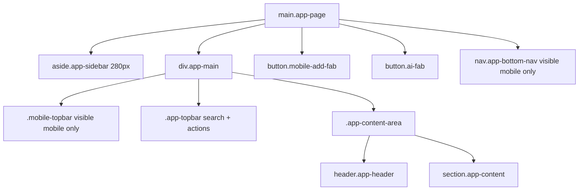

# DESIGN SYSTEM — HL Health Companion (HealthSync Pro)

> **Sumber: audit langsung ke `web/src/index.css` (CSS variables & themes), `web/src/App.css` (6544 LOC utility classes), `web/src/App.tsx` (NAV structure), `web/src/components/*` (22 components), `web/src/pages/*` (47 pages), `web/src/i18n/locales/*` (24 locale files), `web/src/styles/{senior-mode,high-contrast}.css`.**
> Dokumen lama: `archive/docs_legacy_2025_sprint1-5/06-design-system.md`.

---

## 1. Identitas Produk

```text
Product name   : HealthSync Pro (tampilan FE) — sistem: HL Health Companion
Type           : Health logging PWA (React 19 + Vite + TypeScript)
Style          : Material-inspired, accessible, mobile-first
Icon set       : Material Symbols Outlined (variable font, FILL 0/1)
Font           : Inter (sans-serif), fallback system-ui
Color space    : Custom design tokens via CSS variables (--color*)
```

---

## 2. Theme System

Tiga tema warna + dua mode aksesibilitas. Di-set via attribute di `<html>` (`document.documentElement.dataset.theme` / `dataset.accessibility`) — di-toggle dari topbar atau via `PUT /api/profile` (`theme`, `accessibilityMode`).

### 2.1 Color Themes (`html[data-theme="..."]`)

#### 2.1.1 Light (default)

```css
--colorBackground: #f7f9fb;
--colorSurface: #f2f4f6;
--colorSurfaceElevated: #ffffff;
--colorSurfaceContainer: #eceef0;
--colorSurfaceHigh: #e6e8ea;
--colorSurfaceDim: #d8dadc;
--colorSurfaceHighest: #e0e3e5;
--colorTextPrimary: #191c1e;
--colorTextSecondary: #424656;
--colorTextMuted: #737687;
--colorBorder: #c2c6d9;
--colorBorderSoft: #e0e3e5;
--colorPrimary: #0061ff;          /* brand blue */
--colorPrimaryStrong: #004bca;
--colorPrimaryContainer: #0061ff;
--colorPrimaryText: #ffffff;
--colorOnPrimaryContainer: #f1f2ff;
--colorSecondaryContainer: #d0e1fb;
--colorOnSecondaryContainer: #54647a;
--colorTertiary: #005c85;
--colorTertiaryContainer: #0076a9;
--colorOnTertiaryContainer: #eaf4ff;
--colorErrorContainer: #ffdad6;
--colorOnErrorContainer: #93000a;
--colorInverseSurface: #2d3133;
--colorInverseOnSurface: #eff1f3;
```

#### 2.1.2 Warm (sage / earthy)

```css
--colorBackground: #f9faf7;
--colorSurface: #f1f4ed;
--colorPrimary: #2d6a4f;          /* sage green */
--colorPrimaryStrong: #1b4332;
--colorPrimaryContainer: #2d6a4f;
--colorOnPrimaryContainer: #d8e8d0;
--colorSecondaryContainer: #d4e0c8;
--colorTertiary: #4a6741;
```

#### 2.1.3 Dark

```css
--colorBackground: #101418;
--colorSurface: #171c22;
--colorSurfaceElevated: #1d232b;
--colorSurfaceContainer: #252c35;
--colorPrimary: #7fb1ff;
--colorPrimaryText: #07111f;
--colorPrimaryContainer: #7fb1ff;
--colorOnPrimaryContainer: #00174b;
--colorTextPrimary: #f4f7fa;
--colorTextSecondary: #c8d0dc;
--colorTextMuted: #9aa7b8;
--colorBorder: #3d4654;
```

#### 2.1.4 HighContrast (override semua + pakai accent `#facc15`)

```css
--colorBackground: #000000;
--colorSurface: #000000;
--colorTextPrimary: #ffffff;
--colorTextSecondary: #ffffff;
--colorTextMuted: #facc15;
--colorBorder: #ffffff;
--colorBorderSoft: #ffffff;
--colorPrimary: #facc15;
--colorPrimaryText: #000000;
--colorPrimaryContainer: #facc15;
--colorOnPrimaryContainer: #000000;
--colorTertiary: #00ccff;
--colorTertiaryContainer: #006688;
--colorStatusNormal: #00ff66;
--colorStatusInfo: #00ccff;
--colorStatusWarning: #ffff00;
--colorStatusHigh: #ff9900;
--colorStatusCritical: #ff3333;
--colorStatusEmergency: #ff0000;
```

### 2.2 Accessibility Modes (`html[data-accessibility="..."]`)

| Mode | Behavior |
|---|---|
| `normal` (default) | base styling |
| `senior` | `html { font-size: 19px; }` (lebih besar), `SeniorAppShell`取代 sidebar/topbar dengan bottom-nav penuh |
| `highContrast` | swap ke tema high-contrast otomatis |

Disimpan di `HL_userProfiles.accessibilityMode ∈ ('normal','senior','highContrast')`.

---

## 3. Design Tokens

### 3.1 Spacing scale

```text
--space1  = 0.25rem (4px)
--space2  = 0.5rem  (8px)
--space3  = 0.75rem (12px)
--space4  = 1rem    (16px)
--space5  = 1.25rem (20px)
--space6  = 1.5rem  (24px)
--space8  = 2rem    (32px)
--space10 = 2.5rem  (40px)
```

### 3.2 Radius

```text
--radiusSm: 2px
--radiusMd: 4px     (default input, button)
--radiusLg: 8px     (cards, modals)
--radiusXl: 12px    (large surfaces)
--radiusFull: 999px (avatar, badge)
```

### 3.3 Shadows

```text
--shadowSoft : 0px 1px 2px 0px rgba(0,0,0,0.05);
--shadowCard : 0px 4px 6px -1px rgba(0,0,0,0.05);
--shadowModal: 0px 10px 15px -3px rgba(0,0,0,0.10);
```

Dark theme override: `--shadowCard: 0 18px 36px rgba(0,0,0,0.30);`

### 3.4 Typography

```text
--typHeadlineXl:      700 36px/44px Inter
--typHeadlineLg:      600 28px/36px Inter
--typHeadlineLgMobile:600 24px/32px Inter
--typHeadlineMd:      600 20px/28px Inter
--typBodyLg:          400 18px/28px Inter
--typBodyMd:          400 16px/24px Inter
--typBodySm:          400 14px/20px Inter
--typLabelMd:         600 14px/20px Inter
--typLabelSm:         500 12px/16px Inter
```

Mobile-first `clamp()`: `h1 { font-size: clamp(1.65rem, 1.3rem + 1vw, 2.25rem); }`

### 3.5 Layout constants

```text
--sidebarWidth: 280px
--containerMaxWidth: 1440px
--marginDesktop: 32px
--marginTablet:  24px
--marginMobile:  16px
--gutter:        24px
```

### 3.6 Status colors (semantic)

```text
--colorStatusNormal:    #168244 (hijau)
--colorStatusInfo:      #005c85 (biru)
--colorStatusWarning:   #9a6700 (kuning tua)
--colorStatusHigh:      #b45309 (oranye tua)
--colorStatusCritical:  #ba1a1a (merah)
--colorStatusEmergency: #7f1d1d (merah gelap)
```

Dipakai untuk badge severity, alert chips, status pill.

---

## 4. Iconography

**Library:** Material Symbols Outlined (Google Fonts CDN).

```css
.material-symbols-outlined {
  font-family: 'Material Symbols Outlined';
  font-variation-settings: 'FILL' 0, 'wght' 400, 'GRAD' 0, 'opsz' 24;
}
.material-symbols-outlined.fill {
  font-variation-settings: 'FILL' 1, 'wght' 500, 'GRAD' 0, 'opsz' 24;
}
```

Icon dipakai di `App.tsx` sebagai string. Contoh: `local_hospital`, `dashboard`, `monitor_heart`, `water_drop`, `psychology`, `family_restroom`, `smart_toy`, `emergency`, `notifications`, `elderly`, `contrast`, `dark_mode`, `light_mode`, `wb_sunny`.

Penggunaan:

```jsx
<Icon name="dashboard" />
<Icon name="local_hospital" className="fill" />
```

---

## 5. Layout & Shell

### 5.1 App Shell (`App.tsx`)



#### 5.1.1 Sidebar (`aside.app-sidebar`)

- Fixed width 280px, collapsible (`sidebar-collapsed` class + `localStorage.hl-sidebar-collapsed`).
- Brand block: `local_hospital` icon + "HealthSync Pro" wordmark + collapse chevron + emergency support quick button.
- Search box (`topbar-search-wrap` di desktop, di sidebar juga).
- Nav groups (`nav-group`): expandable sections.
- Footer: Welcome Tour, Help Center, Logout.

#### 5.1.2 Topbar (`div.app-topbar`)

- Search (`topbar-search`).
- Live clock (`clock-date`, `clock-time`) — detik update tiap 1 detik.
- `LanguageSwitcher` (compact).
- Theme switcher (light/warm/dark) — inline PUT ke `/api/profile`.
- Display mode switcher (normal/senior/highContrast) — inline PUT.
- Notifications dropdown (bell + count badge) → fetch `/api/alerts?limit=5`.
- User dropdown (displayName + initials avatar + menu).

#### 5.1.3 Mobile bottom nav (`nav.app-bottom-nav`)

5 item (filtered by `MOBILE_NAV_PATHS`):

- `/dashboard` (Today)
- `/measurements/new`
- `/measurements/history`
- `/alerts`
- `/ai-assistant`

Plus FAB (`button.mobile-add-fab` icon `add`) → `/measurements/new`, dan `button.ai-fab` icon `smart_toy` → `/ai-assistant`.

#### 5.1.4 Senior Shell (`SeniorAppShell.tsx`)

Dipakai kalau `profile.accessibilityMode === 'senior'`. Bottom-nav penuh, font-size `19px`, simplified icons.

### 5.2 Page-level skeleton

Setiap page (Today/Weekly/Monthly Dashboard, HydrationPage, dll.) memakai container `.app-content` + header `.app-header` + body. Contoh di `App.tsx`:

```jsx
<section className="app-content">
  {routeBlocked
    ? <UpgradePrompt feature={...} />
    : renderRoute(appPath, navigate)}
</section>
```

`UpgradePrompt` ditampilkan otomatis kalau user Free membuka route dengan `featureCode` (entitlement check).

---

## 6. Navigation Map (47 routes)

```text
NAV_GROUPS (10 groups)
├── Dashboard
│   ├── /dashboard                TodayDashboard
│   ├── /dashboard/week           WeeklyDashboard
│   └── /dashboard/month          MonthlyDashboard
├── Measurements
│   ├── /measurements/new         SelectMetricPage (FAB target)
│   ├── /measurements/history     HistoryPage
│   ├── /daily-health             DailyHealthHubPage
│   ├── /measurements/senior      SeniorMeasurementFlow (hidden, accessibility)
│   └── /history                  HistoryTimelinePage (paid: feature.advancedHistory.use)
├── Reports
│   ├── /reports/daily            DailyReportPage
│   ├── /reports/weekly           WeeklyReportPage
│   ├── /reports/monthly          MonthlyReportPage
│   └── /reports/doctor           DoctorReportPage (paid)
├── Health Tracking
│   ├── /symptoms                 SymptomPage (feature.symptomLog.use)
│   ├── /hydration                HydrationPage (feature.hydration.use)
│   ├── /hydration/history        HydrationHistoryPage (hidden)
│   ├── /hydration/settings       HydrationSettingsPage (hidden)
│   └── /cycle                    CyclePage (paid: feature.cycleTracking.use)
├── Lifestyle
│   ├── /tracker                  TrackerPage (fasting + medication)
│   ├── /fasting                  FastingPage
│   ├── /medications              MedicationsPage
│   ├── /patterns                 PatternsPage
│   └── /reminders                RemindersPage
├── AI & Insights
│   ├── /ai-assistant             AiAssistantPage (feature.aiAssistant.use)
│   └── /ai-memory                AiMemorySettingsPage (paid: feature.vectorMemory.use)
├── Family & Safety
│   ├── /family                   FamilyPage (paid: feature.familyDashboard.use)
│   ├── /emergency                EmergencyContactsPage
│   ├── /alerts                   AlertsPage
│   └── /caregiver                CaregiverDashboardPage (linked-user)
├── Education
│   ├── /kb                       KnowledgeBasePage
│   ├── /faq                      FaqPage
│   └── /manual                   UserManualPage
├── Settings
│   ├── /settings/profile         ProfileSettingsPage
│   ├── /settings/app             AppSettingsPage
│   ├── /settings/billing         BillingSettingsPage
│   ├── /settings/delete          ProfileDeletePage (hidden, privacy)
│   ├── /telegram                 TelegramSettingsPage (paid)
│   └── /premium/upgrade          PremiumUpgradePage (no-block path)
├── Billing
│   ├── /billing/success          BillingSuccessPage
│   ├── /billing/cancel           BillingCancelPage
│   └── /billing/mock-checkout    MockCheckoutPage
├── Admin
│   └── /admin                    AdminPage (adminOnly)
└── Auth (no nav)
    ├── /login                    LoginPage
    ├── /register                 RegisterPage
    └── /onboarding               OnboardingPage
```

PRO badge (`<span class="nav-badge pro-badge">PRO</span>`) muncul di nav item dengan `paidOnly: true` saat `planCode === 'free'`.

---

## 7. Component Inventory (22 file)

### 7.1 Core / Shell

| Component | File | Fungsi |
|---|---|---|
| `ErrorBoundary` | `components/ErrorBoundary.tsx` | Class component, fallback UI generic |
| `Toast` / `ToastProvider` | `components/Toast.tsx` | global toast (success/error/info), pakai context |
| `SeniorAppShell` | `components/SeniorAppShell.tsx` | simplified layout untuk mode senior |
| `WelcomeWizard` | `components/WelcomeWizard.tsx` | first-run tour, dismissable, flag di `localStorage.hl-welcome-seen` |
| `UpgradePrompt` | `components/UpgradePrompt.tsx` | ditunjukkan saat entitlement gagal, CTA ke `/premium/upgrade` |

### 7.2 Auth

| Component | File | Fungsi |
|---|---|---|
| `OtpInput` | `components/auth/OtpInput.tsx` | 6-digit OTP input dengan auto-advance |
| `EmailOtpVerificationStep` | `components/auth/EmailOtpVerificationStep.tsx` | step OTP verify dalam flow register/login |

### 7.3 i18n

| Component | File | Fungsi |
|---|---|---|
| `LanguageSwitcher` | `components/i18n/LanguageSwitcher.tsx` | dropdown ID / EN, persist ke `me/preferences` |

### 7.4 Dashboard

| Component | File | Fungsi |
|---|---|---|
| `TrendBadge` | `components/dashboard/TrendBadge.tsx` (+ `.css`) | badge arrow up/down/sideways + delta color |

### 7.5 Measurement

| Component | File | Fungsi |
|---|---|---|
| `AttachmentUploader` | `components/measurement/AttachmentUploader.tsx` | capture/upload + kompres + watermark (webp q=50) |
| `DynamicMetricForm` | `components/measurement/DynamicMetricForm.tsx` | render form sesuai selected metrics dari `/api/metrics/catalog` |
| `InterpretationPopup` | `components/measurement/InterpretationPopup.tsx` (+ `.css`) | muncul setelah validate, show rule popup + recommendation |
| `ManualOverrideInput` | `components/measurement/ManualOverrideInput.tsx` (+ `.css`) | input dengan flag `manualOverride=1` otomatis kalau diedit |

### 7.6 Shared

| Component | File | Fungsi |
|---|---|---|
| `EmergencyModal` | `components/shared/EmergencyModal.tsx` (+ `.css`) | triggered saat severity=emergency, link ke emergency contacts + telp 119 |

### 7.7 Education & Medical

| Component | File | Fungsi |
|---|---|---|
| `EducationBottomSheet` | `components/EducationBottomSheet.tsx` | tampilkan `HL_educationCards` di-dismissable |
| `MedicalTerm` | `components/MedicalTerm.tsx` | inline tooltip untuk istilah medis (linked KB article) |
| `UnitInfoModal` | `components/UnitInfoModal.tsx` | info unit (mmHg, bpm, %, mg/dL, mmol/L) |
| `AttachmentViewer` | `components/AttachmentViewer.tsx` | preview attachment dari `/api/measurements/attachments/:id` |

---

## 8. i18n (24 locale files)

Lokasi: `web/src/i18n/locales/*.ts` (TS modules export `id` & `en` translation maps).

```text
admin.ts            alerts.ts          auth.ts            billing.ts
caregiver.ts        common.ts          cycle.ts           dashboard.ts
doctor.ts           emergency.ts       errors.ts          family.ts
fasting.ts          hydration.ts       kb.ts              medications.ts
nav.ts              onboarding.ts      patterns.ts        reminders.ts
reports.ts          settings.ts        symptom.ts         measurement.ts
ai.ts
```

API: `I18nProvider` + `useI18n()` (dari `web/src/i18n/index.tsx`) — expose `{ t, locale, setLocale }`. Locale default `id`, fallback `en`.

Persist: `localStorage.hl-locale` + `HL_userProfiles.timezone` + `me/preferences`.

---

## 9. Accessibility (a11y)

- Semantic HTML: `<main>`, `<aside>`, `<nav>`, `<section>`, `<header>`, `<button>`, `<label>`.
- Focus ring: `*:focus-visible { outline: 3px solid var(--colorFocus); outline-offset: 3px; }`.
- Min touch target: `button { min-height: 44px; }`.
- Font size: `html[data-accessibility="senior"] { font-size: 19px; }`.
- High contrast theme: `html[data-accessibility="highContrast"]` atau `html[data-theme="highContrast"]`.
- ARIA labels: `aria-label`, `aria-current="page"`, `aria-hidden`, `aria-expanded`.
- Material icons: `aria-hidden="true"` (dekoratif).

---

## 10. PWA

Lokasi: `web/public/`.

```text
manifest.json   — name, short_name, theme_color #0061ff, background_color #f7f9fb,
                  display: standalone, start_url: /, icons: 192 & 512
sw.js           — service worker (caching strategy: stale-while-revalidate untuk static,
                  network-first untuk /api)
icon-192.svg / icon-512.svg / favicon.svg
```

`main.tsx` mendaftarkan SW + clear stale cache `hl-*` / `health*`. `beforeinstallprompt` event di-capture ke `window.__hlInstallPrompt` untuk "Add to Home Screen" prompt.

---

## 11. Responsive Breakpoints

Tidak pakai Tailwind. Media queries di `App.css`:

```css
/* Desktop default (>1024px) */
@media (max-width: 1024px) { /* tablet — adjust margins */ }
@media (max-width: 768px)  { /* mobile — hide sidebar, show mobile-topbar + bottom-nav */ }
@media (max-width: 480px)  { /* small mobile — reduce sizes */ }
```

Helper tokens:

```text
--marginDesktop: 32px
--marginTablet:  24px
--marginMobile:  16px
--gutter:        24px
```

---

## 12. Page Patterns

### 12.1 Dashboard page

```text
.app-page > .app-main > .app-content-area
  > header.app-header        (title + subtitle)
  > section.app-content
    > .page-grid
      > .metric-card         (icon + title + value + TrendBadge)
      > .session-card        (list sesi hari ini)
      > .ai-insight-card     (dari HL_aiRecommendations.summaryText)
      > .alerts-list
```

### 12.2 Form page

```text
DynamicMetricForm (selected metrics dari catalog)
  > MetricGroup
    > MetricField (per metricCode)
      > Label + required badge
      > ManualOverrideInput (numeric | date | time | enum)
      > UnitInfoModal trigger
      > InterpretationPopup (setelah validate)
  > Submit button (sticky bottom on mobile)
```

### 12.3 List page (Hydration, Symptoms, Logs)

```text
Header + add CTA
Filter chips
  > Calendar / Range picker
  > Source filter
List (cards)
  > timestamp
  > amount/value
  > source badge (telegram | web | system)
  > delete action (dengan confirm)
Empty state
  > "Belum ada data" + CTA pertama
```

---

## 13. Status / Severity Patterns

```text
severity=normal    → chip hijau  (.severity-normal, --colorStatusNormal)
severity=info      → chip biru   (--colorStatusInfo)
severity=warning   → chip kuning (--colorStatusWarning)
severity=high      → chip oranye (--colorStatusHigh)
severity=critical  → chip merah (--colorStatusCritical)
severity=emergency → chip merah gelap + EmergencyModal (--colorStatusEmergency)
```

Dipakai di:
- `HL_alerts.severity` (Sprint 1-4 measurement-centric)
- `HL_safetyEvents.severity` (Sprint 5 non-metric guardrails)
- `HL_measurementValues.severity`
- Notification dropdown di topbar (icon + color).
- TrendBadge (up/down/sideways).

---

## 14. Microinteractions

- Theme switcher & display-mode switcher → optimistic DOM update + PUT `/api/profile`, fallback ke `refresh()` kalau 200.
- Welcome Wizard dismiss → `localStorage.hl-welcome-seen = 'true'`.
- Sidebar collapse → `localStorage.hl-sidebar-collapsed`.
- Search di topbar → prefix match ke NAV_LINKS (labelKey / shortLabel / path).
- Toast auto-dismiss ~3s; manual close button.
- FAB selalu accessible dari semua page (overlay di luar content area).

---

## 15. Dark Mode + Senior Mode Integration

```text
1. User pilih theme di topbar (light/warm/dark)
   → document.documentElement.dataset.theme = thm
   → fetch('/api/profile', PUT { theme, ... })
   → kalau 200: refresh() user state

2. User pilih accessibility (normal/senior/highContrast)
   → document.documentElement.dataset.accessibility = m
   → fetch('/api/profile', PUT { accessibilityMode, ... })

3. Saat reload, App.tsx baca profile.theme/accessibilityMode dan set dataset SEBELUM render.

4. Kalau accessibilityMode === 'senior'
   → App.tsx render <SeniorAppShell> (bukan sidebar/topbar normal)

5. Kalau theme === 'highContrast' atau accessibility === 'highContrast'
   → :root variables di-override sesuai blok di index.css
```

---

## 16. Aset Visual

- **Brand icon**: `local_hospital` (Material Symbols, FILL=1).
- **Logo type**: "HealthSync Pro" (`<h1>` Inter 700).
- **Hero image** (di `site/`): `/public/images/blog/*`.
- **Mockup HTML referensi**: `web/frontend_stitch/*.html` (legacy, tidak di-bundle).
- **Mockup Sprint 5**: `docs_sprint5/Frontend/*.html` (admin, premium, education, audit).
- **Site marketing**: `site/` (Astro 5 — public landing page, blog, pricing).

---

## 17. CSS Architecture

- **Single global**: `web/src/index.css` — design tokens (CSS variables), reset, typography, accessibility overrides.
- **Single component bundle**: `web/src/App.css` (6544 LOC) — semua utility classes + component-specific (`.app-page`, `.app-sidebar`, `.nav-group`, `.metric-card`, `.severity-*`, dll).
- **Component-scoped CSS** (hanya untuk kasus khusus):
  - `components/dashboard/TrendBadge.css`
  - `components/measurement/{InterpretationPopup,ManualOverrideInput}.css`
  - `components/shared/EmergencyModal.css`
- **Mode overrides**:
  - `styles/senior-mode.css` (extra rule untuk senior shell)
  - `styles/high-contrast.css` (extra rule untuk high-contrast)

Tidak ada CSS-in-JS, tidak ada Tailwind, tidak ada preprocessor (Sass/Less). Konvensi: utility class flat + design tokens.

---

## 18. Do & Don't

✅ DO:
- Pakai design tokens (`var(--colorPrimary)`) bukan hex literal.
- Pakai Material Symbols via `<Icon name="..." />` helper.
- Pakai semantic HTML (`<button>`, `<nav>`, `<main>`).
- Pakai `data-theme` / `data-accessibility` untuk theming.
- Pakai `min-height: 44px` pada interactive elements.

❌ DON'T:
- Hardcode warna hex di component (pakai token).
- Pakai emoji sebagai icon.
- Pakai `<div onClick>`代替 `<button>`.
- Set font-size literal di luar design tokens.
- Pakai library icon lain (Material Symbols adalah standar).
- Tambah CSS baru tanpa extend design tokens.

---

Lihat juga:
- Schema: `docs/07-schema.sql`
- API Contract: `docs/05-api-contract.md`
- Architecture: `docs/04-ARCHITECTURE.md`
- PRD Sprint 1–5: `docs/01-PRD_SPRINT1-5.md`
